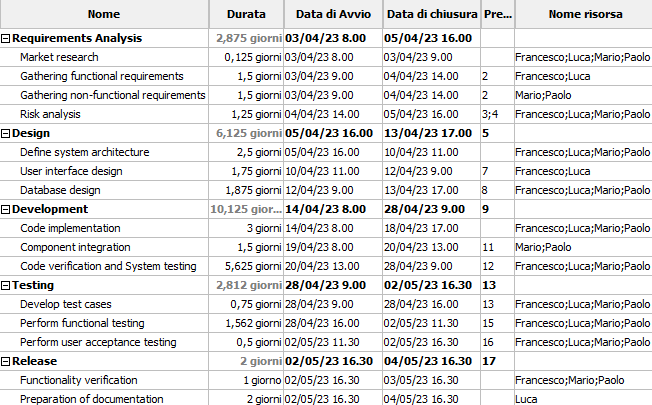

# Project Estimation - CURRENT
Date: 12/04/2023

Version: 1

# Estimation approach
Consider the EZWallet  project in CURRENT version (as received by the teachers), assume that you are going to develop the project INDEPENDENT of the deadlines of the course

# Estimate by size
### 
|             | Estimate                        |             
| ----------- | ------------------------------- |  
| NC = Estimated number of modules to be developed | 18 |           
| A = Estimated average size per class, in LOC     | 50 LOC/NC | 
| S = Estimated size of project, in LOC (= NC * A) | 898 LOC |
| E = Estimated effort, in person hours (here use productivity 10 LOC per person hour)  | 90 ph |   
| C = Estimated cost, in euro (here use 1 person hour cost = 30 euro) | 2700 EUR | 
| Estimated calendar time, in calendar weeks (Assume team of 4 people, 8 hours per day, 5 days per week ) | 0,56 week |   

For the number of modules was chosen the number of functions.

# Estimate by product decomposition
### 

|         component name    | Estimated effort (person hours)   |             
| ----------- | ------------------------------- | 
| Requirement document | (5 days * 2 people) -> 80 ph |
| GUI prototype | (2 days * 1 people) -> 16 ph |
| Design document | (2 days * 2 people) -> 32 ph |
| Code | (3 days * 4 people) 96 ph |
| Unit tests | (4 days * 4 people) 128 ph |
| API tests | (4 days * 4 people) 128 ph |
| Management documents | (1 day * 1 person) -> 8 ph  |
| TOT |  488 ph -> 3,05 weeks |

# Estimate by activity decomposition
### WBS 

    1. Requirements Analysis
        1.1 Market research
        1.2 Gathering functional requirements
        1.3 Gathering non-functional requirements
        1.4 Risk analysis

    2. Design
        2.1 Define system architecture
        2.2 User interface design
        2.3 Database design

    3. Development
        3.1 Code implementation
        3.2 Component integration
        3.3 Code verification and System testing

    4. Testing
        4.1 Develop test cases
        4.2 Perform functional testing
        4.3 Perform user acceptance testing

    5. Release
        5.1 Functionality verification
        5.2 Preparation of documentation

# Estimate by activity decomposition
### 
|         Activity name    | Estimated effort (person hours)   |             
| ----------- | ------------------------------- | 
| Requirements Analysis |  |
| Market research | 4 ph |
| Gathering functional requirements | 24 ph |
| Gathering non-functional requirements | 24 ph |
| Risk analysis | 40 ph |
| Design | |
| Define system architecture | 80 ph |
| User interface design | 28 ph |
| Database design | 60 ph |
| Development |  |
| Code implementation | 96 ph |
| Component integration | 24 ph |
| Code verification and System testing | 180 ph |
| Testing |  |
| Develop test cases | 24 ph |
| Perform functional testing | 50 ph |
| Perform user acceptance testing | 16 ph |
| Release |  |
| Functionality verification | 24 ph |
| Preparation of documentation | 16 ph |
| TOT | 690 ph |

### Gant chart

# Summary

The three estimations are significatly different for several reasons. 
The estimation by size is the shortest because this method does not take into account the specific activities involved in the project and it may not always be accurate, although it can be quick and easy. 
The estimation by product decomposition takes into account the specific activities required for each component so it is longer than the estimation by size and more accurate. 
The estimation by activity decomposition, as that with product decomposition, takes into account the specific activities required for each component and also consider in more detail each activity with the rispectivitly resources used. 

|             | Estimated effort                        |   Estimated duration |          
| ----------- | ------------------------------- | ---------------|
| estimate by size | 90 ph | 0,56 week |
| estimate by product decomposition | 488 ph | 3,05 weeks |
| estimate by activity decomposition | 690 ph | 5 weeks |