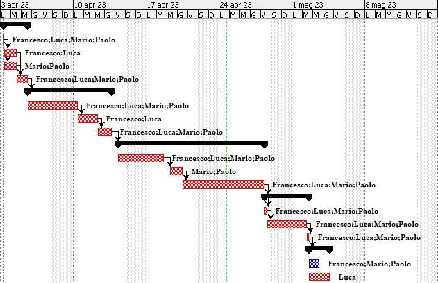

# Project Estimation - CURRENT
Date: 12/04/2023

Version: 1

# Estimation approach
Consider the EZWallet  project in CURRENT version (as received by the teachers), assume that you are going to develop the project INDEPENDENT of the deadlines of the course
# Estimate by size
### 
|             | Estimate                        |             
| ----------- | ------------------------------- |  
| NC = Estimated number of classes to be developed | 9 |             
| A = Estimated average size per class, in LOC     | 100 LOC/NC | 
| S = Estimated size of project, in LOC (= NC * A) | 898 LOC |
| E = Estimated effort, in person hours (here use productivity 10 LOC per person hour)  | 90 ph |   
| C = Estimated cost, in euro (here use 1 person hour cost = 30 euro) | 2700 EUR | 
| Estimated calendar time, in calendar weeks (Assume team of 4 people, 8 hours per day, 5 days per week ) | 1 week |               

# Estimate by product decomposition
### 

|         component name    | Estimated effort (person hours)   |             
| ----------- | ------------------------------- | 
| requirement document | (5 days * 2 people) -> 80 ph |
| GUI prototype | (2 days * 1 people) -> 16 ph |
| design document | (2 days * 2 people) -> 32 ph |
| code | (3 days * 4 people) 96 ph |
| unit tests | (5 days * 4 people) 160 ph |
| api tests | (3 days * 4 people) 96 ph |
| management documents | (1 day * 1 person) -> 8 ph  |
| ----------- | ( TOT = 488 ph ) -> 3 weeks |

# Estimate by activity decomposition

## WBS 

### Project

    1. Requirements Analysis
        1.1 Market research
        1.2 Gathering functional requirements
        1.3 Gathering non-functional requirements
        1.4 Risk analysis

    2. Design
        2.1 Architectural design
        2.2 Detailed design
        2.3 User interface design
        2.4 Database design

    3. Development
        3.1 Code implementation
        3.2 Component integration
        3.3 Code verification and System testing

    4. Release
        4.1 Preparation of documentation
        4.2 Functionality verification

# Estimate by activity decomposition
### 
|         Activity name    | Estimated effort (person hours)   |             
| ----------- | ------------------------------- | 
| - Requirements Analysis - | ----------- |
| Market research | 4 ph |
| Gathering functional requirements | 24 ph |
| Gathering non-functional requirements | 20 ph |
| Risk analysis | 40 ph |
| - Design - | ----------- |
| Architectural design | 40 ph |
| Detailed design | 40 ph |
| User interface design | 28 ph |
| Database design | 70 ph |
| - Development - | ----------- |
| Code implementation | 96 ph |
| Component integration | 24 ph |
| Code verification and System testing | 180 ph |
| - Release - | ----------- |
| Preparation of documentation | 16 ph |
| Functionality verification | 24 ph |
| TOT | 606 ph |

###
Insert here Gantt chart with above activities

# Summary

Report here the results of the three estimation approaches. The  estimates may differ. Discuss here the possible reasons for the difference

|             | Estimated effort                        |   Estimated duration |          
| ----------- | ------------------------------- | ---------------|
| estimate by size | 90 ph | 1 week |
| estimate by product decomposition | 488 ph | 3 weeks |
| estimate by activity decomposition | 615 ph | 7 weeks |