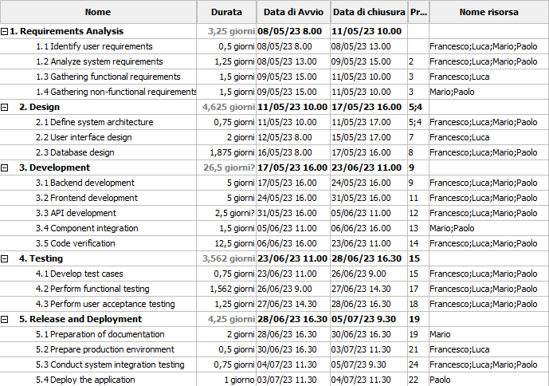
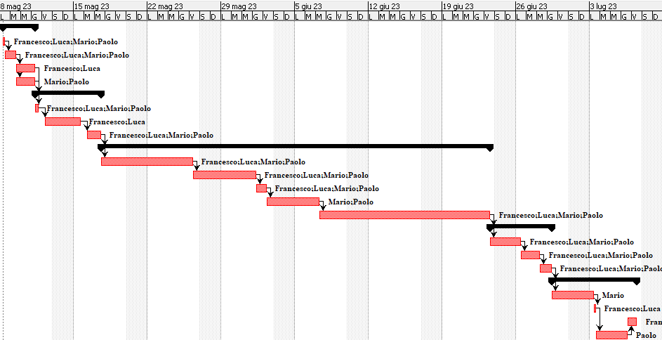

# Project Estimation - FUTURE
Date: 21/04/2023

Version: 2

# Estimation approach
Consider the EZWallet  project in FUTURE version (as proposed by the team), assume that you are going to develop the project INDEPENDENT of the deadlines of the course. 

For these estimations we are considering only the new part of the project that has to be implemented without contemplate the part already implemented in the first version. Moreover in these previsions for the coding part we are appraising only the development of the back-end of the application. For simplicity, we are thinking that the back-end is unique for web, android and iOS application without considering the native development part for android and iOS and the integration part with their respective APIs.

# Estimate by size
### 

|             | Estimate                        |             
| ----------- | ------------------------------- |  
| NC =  Estimated number of modules to be developed   | 40 |    
| A = Estimated average size per class, in LOC        | 30 LOC/NC | 
| S = Estimated size of project, in LOC (= NC * A)    | 1200 LOC |
| E = Estimated effort, in person hours (here use productivity 10 LOC per person hour)  | 120 ph |   
| C = Estimated cost, in euro (here use 1 person hour cost = 30 euro) | 3600 EUR | 
| Estimated calendar time, in calendar weeks (Assume team of 4 people, 8 hours per day, 5 days per week ) | 0,75 week |               

For the number of modules was chosen the number of functions.

# Estimate by product decomposition
### 
|         component name    | Estimated effort (person hours)   |             
| ----------- | ------------------------------- | 
| Requirement document | (5 days * 2 people) -> 80 ph |
| GUI prototype | (2 days * 2 people) -> 32 ph |
| Design document | (3 days * 2 people) -> 48 ph |
| Code | (4 days * 4 people) 128 ph |
| Unit tests | (5 days * 4 people) 160 ph |
| API tests | (5 days * 4 people) 160 ph |
| Management documents | (1 day * 1 person) -> 8 ph  |
| TOT | 616 ph -> 3,85 weeks |

# Estimate by activity decomposition

### WBS
 
    1. Requirements Analysis
        1.1 Identify user requirements
        1.2 Analyze system requirements
        1.3 Gathering functional requirements
        1.4 Gathering non-functional requirements

    2. Design
        2.1 Define system architecture
        2.2 User interface design
            2.2.1  GUI prototype for web application
            2.2.2  GUI prototype for Android application
            2.2.3  GUI prototype for iOS application
        2.3 Database design

    3. Development
        3.1 Code implementation
        3.2 Component integration
        3.3 Code verification

    4. Testing
        4.1 Develop test cases
        4.2 Perform functional testing
        4.3 Perform user acceptance testing

    5. Release and Deployment
        5.1 Preparation of documentation
        5.2 Prepare production environment
        5.3 Conduct system integration testing
        5.4 Deploy the application (App store, Play store and web)

    6. Maintenance and support
        6.1 Provide technical support
        6.2 Fix bugs and troubleshoot issues
        6.3 Implement updates and upgrades 

|         Activity name    | Estimated effort (person hours)   |             
| ----------- | ------------------------------- | 
| Requirements Analysis | |
| Identify user requirements | 16 ph |
| Analyze system requirements | 40 ph |
| Gathering functional requirements | 24 ph |
| Gathering non-functional requirements | 24 ph |
| Design | |
| Define system architecture | 24 ph |
| User interface design | 32 ph |
| Database design | 60 ph |
| Development | |
| Code implementation | 128 ph |
| Component integration | 24 ph |
| Code verification | 200 ph |
| Testing | |
| Develop test cases | 24 ph |
| Perform functional testing | 50 ph |
| Perform user acceptance testing | 40 ph |
| Release and Deployment | |
| Preparation of documentation | 16 ph |
| Prepare production environment | 8 ph |
| Conduct system integration testing | 24 ph |
| Deploy the application | 8 ph |
| Maintenance and support | - ongoing - |
| Provide technical support | 24 ph/week |
| Fix bugs and troubleshoot issues | 32 ph/month |
| Implement updates and upgrades | - |
| TOT | 742 ph |

For this estimation we have insert also the deployment and the maintanance and support parts to give an image of the entire development of the application.

### Gantt chart

# Summary

The three estimations are significatly different for several reasons. 
The estimation by size is the shortest because this method does not take into account the specific activities involved in the project and it may not always be accurate, although it can be quick and easy. 
The estimation by product decomposition takes into account the specific activities required for each component so it is longer than the estimation by size and more accurate. 
The estimation by activity decomposition, as that with product decomposition, takes into account the specific activities required for each component and also consider in more detail each activity with the rispectivitly resources used. 

|             | Estimated effort                        |   Estimated duration |          
| ----------- | ------------------------------- | ---------------|
| estimate by size | 120 ph | 0,75 week|
| estimate by product decomposition | 616 ph | 3,85 weeks |
| estimate by activity decomposition | 742 ph | 6 weeks |