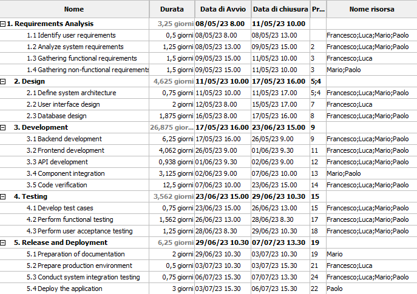

# Project Estimation - FUTURE
Date: 21/04/2023

Version: 2

# Estimation approach
Consider the EZWallet  project in FUTURE version (as proposed by the team), assume that you are going to develop the project INDEPENDENT of the deadlines of the course
# Estimate by size
### 
|             | Estimate                        |             
| ----------- | ------------------------------- |  
| NC =  Estimated number of classes to be developed   | 9 |             
| A = Estimated average size per class, in LOC       | 56 LOC/NC | 
| S = Estimated size of project, in LOC (= NC * A)  | 500 LOC |
| E = Estimated effort, in person hours (here use productivity 10 LOC per person hour)  | 50 ph |   
| C = Estimated cost, in euro (here use 1 person hour cost = 30 euro) | 1500 EUR | 
| Estimated calendar time, in calendar weeks (Assume team of 4 people, 8 hours per day, 5 days per week ) | 0,3 week |               

# Estimate by product decomposition
### 
|         component name    | Estimated effort (person hours)   |             
| ----------- | ------------------------------- | 
| Requirement document | (3 days * 2 people) -> 48 ph |
| GUI prototype | (1 days * 1 people) -> 8 ph |
| Design document | (1 days * 2 people) -> 16 ph |
| Code | (2 days * 4 people) 64 ph |
| Unit tests | (3 days * 4 people) 96 ph |
| API tests | (3 days * 4 people) 96 ph |
| Management documents | (1 day * 1 person) -> 8 ph  |
| TOT | 336 ph -> 2,1 weeks |

# Estimate by activity decomposition
## WBS 

### Project
 
    1. Requirements Analysis
        1.1 Identify user requirements
        1.2 Analyze system requirements
        1.3 Gathering functional requirements
        1.4 Gathering non-functional requirements

    2. Design
        2.1 Define system architecture
        2.2 User interface design
        2.3 Database design

    3. Development
        3.1 Code implementation
        3.2 Component integration
        3.3 Code verification

    4. Testing
        4.1 Develop test cases
        4.2 Perform functional testing
        4.3 Perform user acceptance testing

    5. Release
        5.1 Functionality verification
        5.2 Preparation of documentation

    6. Deployment
        6.1 Prepare production environment
        6.2 Deploy the application
        6.3 Conduct system integration testing

    7. Maintenance and support
        7.1 Provide technical support
        7.2 Fix bugs and troubleshoot issues
        7.3 Implement updates and upgrades 

|         Activity name    | Estimated effort (person hours)   |             
| ----------- | ------------------------------- | 
| Requirements Analysis | |
| Identify user requirements | 8 ph |
| Analyze system requirements | 16 ph |
| Gathering functional requirements | 16 ph |
| Gathering non-functional requirements | 16 ph |
| Design | |
| Define system architecture | 24 ph |
| User interface design | 16 ph |
| Database design | 40 ph |
| Development | |
| Code implementation | 50 ph |
| Component integration | 24 ph |
| Code verification | 100 ph |
| Testing | |
| Develop test cases | 24 ph |
| Perform functional testing | 50 ph |
| Perform user acceptance testing | 80 ph |
| Release | |
| Functionality verification | 24 ph |
| Preparation of documentation | 16 ph |
| Deployment | |
| Prepare production environment | 8 ph |
| Deploy the application | 8 ph |
| Conduct system integration testing | 8 ph |
| Maintenance and support | - ongoing - |
| Provide technical support |  |
| Fix bugs and troubleshoot issues |  |
| Implement updates and upgrades |  |
| TOT | 528 ph |

### Gantt chart

# Summary

Report here the results of the three estimation approaches. The  estimates may differ. Discuss here the possible reasons for the difference

|             | Estimated effort                        |   Estimated duration |          
| ----------- | ------------------------------- | ---------------|
| estimate by size | 50 ph | 0,3 week|
| estimate by product decomposition | 336 ph | 2,1 weeks |
| estimate by activity decomposition | 528 ph | 4 weeks |