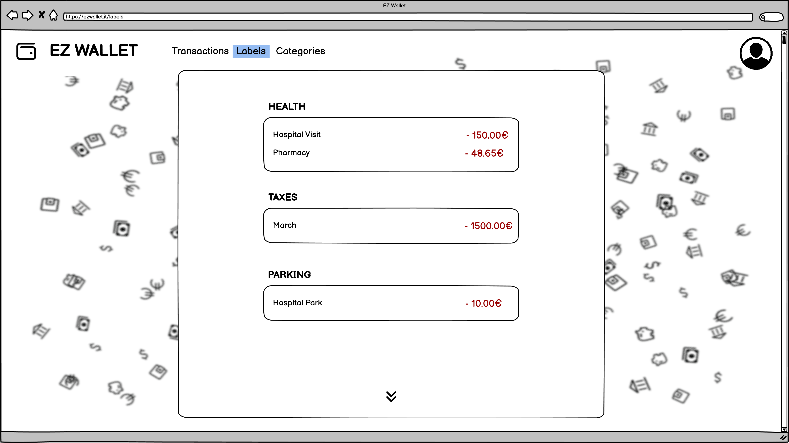

# Graphical User Interface Prototype  - CURRENT

Date: 16/04/2023  
Version: V1  

# Landing Page

   
When searching the app, the landing page is what is presented to the user, that can choose to login, if they have an account, or register to the service.  

# Login Page

   
Page for the user login, where username and password can be inserted. if the login process goes wrong, an error is returned. 

   

# Register Page

   
Here a new user can register itself, providing a valid email, username and a password.

# Transactions page

   
The main page of the application display the user's transactions, in chronological order. The info for each transaction are: date, category, name and amount. 
From this page, the user can add a new transaction from the empty form, writing the type, name and amount.  
Clicking on the button at the end of each transaction form, the user can delete it.  

# Labels page

   
In this page, the transactions are grouped by category, so that the user can view all the expenses from each category separately.  

# Categories page

   
In this page, the user can see all the categories available. A new category can also be added.  

   

# User info

   
Clicking on the placeholder in the top right of the screen, the user can see its info, and also do a logout operation.  

   
The user's info can also be reached directly whith the /users/:username route.  

   
This page, in this version reachable only via the route /users, displays all the users and their info.  
