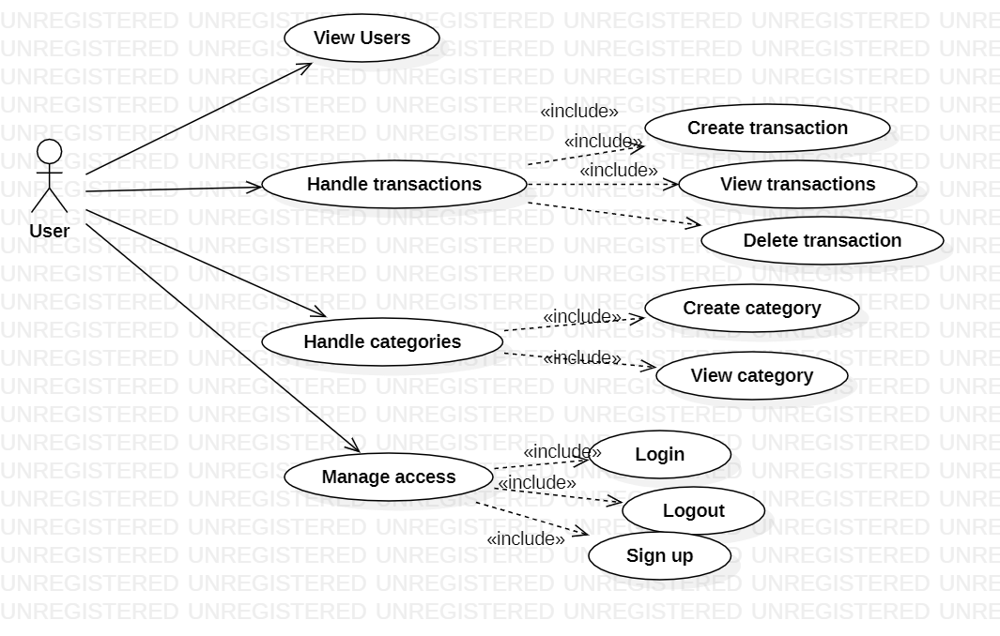
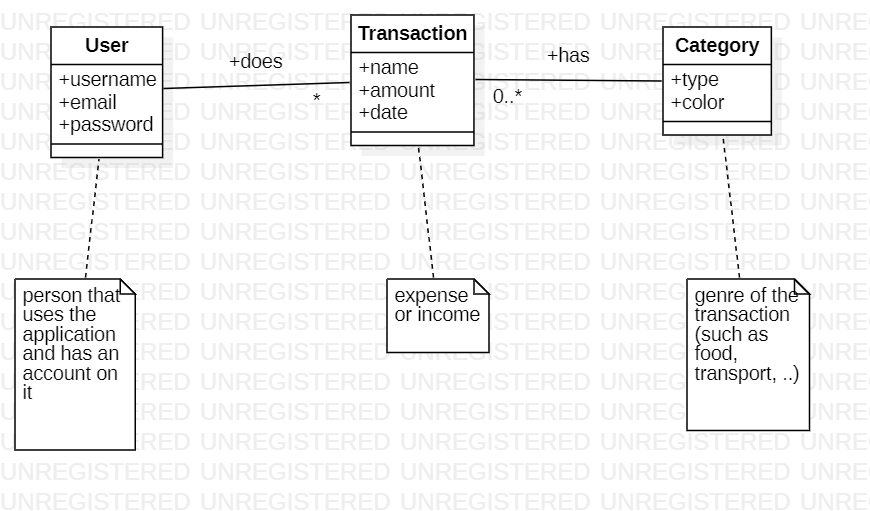
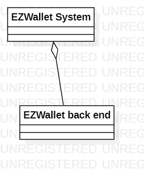
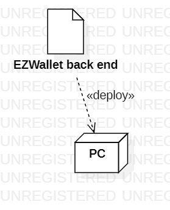

# Requirements Document - current EZWallet

Date: 

Version: V1 - description of EZWallet in CURRENT form (as received by teachers)

 
| Version number | Change |
| ----------------- |:-----------|
| 1 | Implementation of the requirement document V1 | 

# Contents

- [Informal description](#informal-description)
- [Stakeholders](#stakeholders)
- [Context Diagram and interfaces](#context-diagram-and-interfaces)
	+ [Context Diagram](#context-diagram)
	+ [Interfaces](#interfaces) 
	
- [Stories and personas](#stories-and-personas)
- [Functional and non functional requirements](#functional-and-non-functional-requirements)
	+ [Functional Requirements](#functional-requirements)
	+ [Non functional requirements](#non-functional-requirements)
- [Use case diagram and use cases](#use-case-diagram-and-use-cases)
	+ [Use case diagram](#use-case-diagram)
	+ [Use cases](#use-cases)
    	+ [Relevant scenarios](#relevant-scenarios)
- [Glossary](#glossary)
- [System design](#system-design)
- [Deployment diagram](#deployment-diagram)

# Informal description
EZWallet (read EaSy Wallet) is a software application designed to help individuals and families keep track of their expenses. Users can enter and categorize their expenses, allowing them to quickly see where their money is going. EZWallet is a powerful tool for those looking to take control of their finances and make informed decisions about their spending.

# Error table

| Error | Description | 
| ----------------- |:-----------|
| get_users not working | In the first version of EZWallet, the function get_users has many problems. In fact, it creates an high privacy concern since each user of the application would be able to see all the users currently registered. Furthermore, since the function doesn't check if we're logged in, the concern is even more relevant since everyone (even people not registered in EZWallet) would have access to these information. Due to this, in our documents we'll report it for the sake of completeness even if it doesn't make sense to implement it yet (and for this reason we didn't create a direct link in our GUI to access it, i.e. it can be reached only through its url). |
| get_labels not working | The idea of get_labels is to join the table of transactions and the table of categories in order to attach to the transactions the color of the related category. However, due to a bug get_labels doesn't return the color. |
| Transactions and categories saved for all the users | In the table for transactions and categories, there's no field to store the user that created them. Due to this, each user will always see the transactions and categories of any user using the application. This is a great problem for many reasons. Firstly, it is a great privacy issue. Furthermore, the users won't be able to use the application since, unless there's only one of them, they won't be able to find their transactions/categories, and the visualization will be really bad. |

# Stakeholders

| Stakeholder name  | Description | 
| ----------------- |:-----------|
|   User     | A person who benefits from the application services.| 
| Development team | A group of developers whose purpose is software development, maintenance and provision of relative services.|
|   Supervisor     | Individual that monitors and judges the smooth running of the software production performed by the devolpment team.|
| Competitor   | Individual, organization or company that operates in the same industry of the software application and they may compete on various factors in order to gain a competitive advantage over the production of this software.| 
| Law regulators   | Entities or organization that are responsible for enforcing laws and regulations in order to ensure that the rights of consumers or other stakeholders are protected.| 

# Context Diagram and interfaces

## Context Diagram

## Interfaces

| Actor | Logical Interface | Physical Interface  |
| ------------- |:-------------:| :-----:|
|   User     | GUI | PC |

# Stories and personas

Persona 1: 
Sara, 32 years old, she is a busy business professional. Single, workaholic, she is always in a hurry and has no time for anything else because her schedule is always full. She is always struggling with managing her personal finances.  
Story: 
Sara often found herself overspending and not knowing where her money was going. She signed up for an account and started adding transactions. Every time she made a purchase, she would log into the software and add the transaction, along with the category it belonged to. The software had the possibility to create new categories according to her needs so she added some like groceries, entertainment, transportation, and more, which made it easy for Sara to categorize her expenses and see where her money was going.

Persona 2: 
Eric, 20 years old, he is an undergraduate student. He is trying to balance his studies with part-time job to make ends meet. He needs a web solution that helps him manage his finances by tracking his spending. 
Story: 
Eric goes out every weekend with friends and finds himself flat broke at the end of the month with rent left to pay. He found this app that tracks all his purchases so he can account on what he spends more on. He registered and every time he paid for something he added the relative transaction to the app. After a month of use, he noticed that he was spending more than he could afford and decided to give a cut with alchool.

Persona 3: 
Lorenzo, male, 47 years old. He is an important ambassador always on travelling for business purposes. He has 5 credit cards that he uses for both personal and business expenses.  
Story: 
Lorenzo sees his salary, extras and other earnings credited to multiple banking accounts and this makes it difficult for him to understand the total amount of expenditures that he makes. Moreover, sometimes he also gets refunded for some business expenses. Since he registered to EZWallet he could finally have a general overview of its movements. Everytime he wants, he logs into his account through the browser of his smartphone and adds a transaction with all the info and a label depending on whether the transaction is personal or business. If he gets refunded he can delete the affected transaction easily. For its ease of use and accuracy, the application meets Lorenzo's needs.

# Functional and non functional requirements

## Functional Requirements

| ID        | Description  |
| :------------- |:-------------| 
|  FR1    <ul><li>FR1.1</li><li>FR1.2</li><li>FR1.3</li></ul>   | Manage account <ul><li>Register</li><li>Login</li><li>Logout</li></ul>|
|  FR2  <ul><li>FR2.1</li><li>FR2.2</li><li>FR2.3</li></ul> |  Handle transactions <ul><li>Create transaction</li><li>Show transaction</li><li>Delete transaction</li></ul>|
|  FR3  <ul><li>FR3.1</li><li>FR3.2</li></ul> |  Handle categories <ul><li>Create category</li><li>Show category</li></ul>|
| FR4 | Get labels in order to  categorize each transaction |
|  FR5  <ul><li>FR5.1</li><li>FR5.2</li></ul> |  Handle users <ul><li>Show all existing users</li><li>Show account info</li></ul>|

## Non Functional Requirements

| ID        | Type (efficiency, reliability, ..)           | Description  | Refers to |
| ------------- |:-------------:| :-----| -----:|
|  NFR1     |  Security | Access token should be limited to 1h starting from when user logged in | FR1|
|  NFR2     | Security| Refresh token should be limited to 7 days from when user logged in. |FR1 |
|  NFR3     | Security| The user password has to be encrypted. |FR1.1 |
|  NFR4     |Efficiency | The system should have a response time lower than 0.5 sec.|FR1,FR2,FR3,FR4,FR5 |
| NFR5 |Usability | At least 95% of non-technical users with more than 1 year of experience of using PC can determine what is the core features related to the website page they are on.| FR1,FR2,FR3,FR4,FR5| 
| NFR6 |Reliability | The system must perform without failure in 99 percent of use cases during a month.| FR1,FR2,FR3,FR4,FR5| 
| NFR7 |Reliability | At most one critical severity defect per year.| FR1,FR2,FR3,FR4,FR5| 
| NFR8 |Availability |The website must be available to users 99.97 percent of the time every month during business hours CEST.| FR1,FR2,FR3,FR4,FR5| 

# Use case diagram and use cases

## Use case diagram

### Use case 1, Login (UC1)
| Actors Involved        | User |
| ------------- |:-------------:| 
|  Precondition     | User not logged in, user registered |
|  Post condition     | User logged in |
|  Nominal Scenario     | Scenario 1.1 |
|  Variants     | None |
|  Exceptions     | Scenario 1.2, 1.3, 1.4, 1.5 |

##### Scenario 1.1 

| Scenario 1.1 | Login |
| ------------- |:-------------:| 
|  Precondition     | User not logged in, user registered |
|  Post condition     | User logged in |
| Step#        | Description  |
|  1     | User: Open the login page. |  
|  2     | User: Provide email, password. |
|  3     | System: Get email, password. The cookie check confirms that the user is not logged in. |
|  4	 | System: Given email, find the user. |
|  5	 | System: Given the user, compare the password provided with the one saved. They match. |
|  6	 | System: Authorize the user |

##### Scenario 1.2

| Scenario 1.2 | Wrong password |
| ------------- |:-------------:| 
|  Precondition     | User not logged in, user registered |
|  Post condition     | User not logged in |
| Step#        | Description  |
|  1     | User: Open the login page. |  
|  2     | User: Provide email, password. |
|  3     | System: Get email, password. The cookie check confirms that the user is not logged in. |
|  4	 | System: Given email, find the user. |
|  5	 | System: Given the user, compare the password provided with the one saved. They don't match.x|
|  6	 | System: Show an error message to explain the problem. |

##### Scenario 1.3

| Scenario 1.3 | User not registered |
| ------------- |:-------------:| 
|  Precondition     | User not logged in, user not registered |
|  Post condition     | User not logged in |
| Step#        | Description  |
|  1     | User: Open the login page. |  
|  2     | User: Provide email, password. |
|  3     | System: Get email, password. The cookie check confirms that the user is not logged in. |
|  4	 | System: Given email, find the user. User not found. |
|  5	 | System: Show an error message to explain the problem. |

##### Scenario 1.4

| Scenario 1.4 | User already logged in |
| ------------- |:-------------:| 
|  Precondition     | User logged in, user registered |
|  Post condition     | User logged in |
| Step#        | Description  |
|  1     | User: Open the login page. |  
|  2     | User: Provide email, password. |
|  3     | System: Get email, password. The cookie check shows that the user is already logged in. |
|  4	 | System: Return an error message to explain the problem. |

##### Scenario 1.5

| Scenario 1.5 | Missing data |
| ------------- |:-------------:| 
|  Precondition     | None |
|  Post condition     | Error |
| Step#        | Description  |
|  1     | User: Open the login page. |  
|  2     | User: Don't provide email and/or password. |
|  3     | System: Get email, password. Notice that some data is missing. |
|  4	 | System: Return an error message to explain the problem. |

### Use case 2, Logout (UC2)

| Actors Involved        | User |
| ------------- |:-------------:| 
|  Precondition     | User logged in |
|  Post condition     | User not logged in |
|  Nominal Scenario     | Scenario 2.1 |
|  Variants     | Scenario 2.2 |
|  Exceptions     | Scenario 2.3, 2.4 |

##### Scenario 2.1 

| Scenario 2.1 | Logout through button |
| ------------- |:-------------:| 
|  Precondition     | User logged in |
|  Post condition     | User not logged in |
| Step#        | Description  |
|  1     | User: Open the homepage of EZWallet. |  
|  2     | System: Check that the user isn't already logged out. |
|  3     | User: Click on logout button. |
|  4     | System: Find the user. |
|  5	 | System: Update user information (remove authorization to the user device). |
|  6	 | System: Show a logout confirmation message. |

##### Scenario 2.2 

| Scenario 2.2 | Logout through address |
| ------------- |:-------------:| 
|  Precondition     | User logged in |
|  Post condition     | User not logged in |
| Step#        | Description  |
|  1     | User: Go to /logout address. |
|  2     | System: Check that the user isn't already logged out. |
|  3     | System: Find the user. |
|  4	 | System: Update user information (remove authorization to the user device). |
|  5	 | System: Show a logout confirmation message. |

##### Scenario 2.3 

| Scenario 2.3 | User already logged out |
| ------------- |:-------------:| 
|  Precondition     | User not logged in |
|  Post condition     | User not logged in |
| Step#        | Description  |
|  1     | User: Go to /logout address. |  
|  2     | System: Check that the user isn't already logged out. |
|  3     | System: User hasn't performed login yet. Display an error message. |

##### Scenario 2.4 

| Scenario 2.4 | The user doesn't exist |
| ------------- |:-------------:| 
|  Precondition     | None |
|  Post condition     | Error |
| Step#        | Description  |
|  1     | User: Go to /logout address. |
|  2     | System: Check that the user isn't already logged out. |
|  3     | System: Find the user. |
|  4	 | System: User not found, show an error message. |

### Use case 3, Registration (UC3)

| Actors Involved        | User |
| ------------- |:-------------:| 
|  Precondition     | The user doesn't have an account |
|  Post condition     | User registered |
|  Nominal Scenario     | Scenario 3.1 |
|  Variants     | None |
|  Exceptions     | Scenario 3.2 |

##### Scenario 3.1 

| Scenario 3.1 | Registration |
| ------------- |:-------------:| 
|  Precondition     | The user doesn't have an account |
|  Post condition     | User registered |
| Step#        | Description  |
|  1     | User: Open the login page of EZWallet. |  
|  2     | User: Click on register button. |
|  3     | User: Provide username, email, password. |
|  4     | System: Retrieve username, email, password. |
|  5     | System: Check that the provided email isn't associated with any account yet. The email hasn't been used yet. |
|  6     | System: Create a new user and store his information (encrypt in some way the password). |
|  7	 | System: Show a registration confirmation message. |

##### Scenario 3.2 

| Scenario 3.2 | User already registered |
| ------------- |:-------------:| 
|  Precondition     | The user has an account |
|  Post condition     | Registration failed |
| Step#        | Description  |
|  1     | User: Open the login page of EZWallet. |  
|  2     | User: Click on register button. |
|  3     | User: Provide username, email, password. |
|  4     | System: Retrieve username, email, password. |
|  5     | System: Check that the provided email isn't associated with any account yet. The email has already been used. |
|  6	 | System: Show an error message. |

### Use case 4, Handle transactions (UC4)

| Actors Involved        | User |
| ------------- |:-------------:| 
|  Precondition     | The user is logged in |
|  Post condition     | Transaction inserted/deleted/shown |
|  Nominal Scenario     | Scenario 4.1, 4.2, 4.3 |
|  Variants     | Scenario 4.5 |
|  Exceptions     | Scenario 4.4 |

##### Scenario 4.1 

| Scenario 4.1 | Insert transaction |
| ------------- |:-------------:| 
|  Precondition     | The user is logged in |
|  Post condition     | Transaction inserted |
| Step#        | Description  |
|  1     | User: Open the homepage of EZWallet. |  
|  2     | System: Check if the user is logged in. |
|  3     | System: Retrieve all the transactions and show them. |
|  4     | User: Insert in the proper fields name, amount and type of the transaction. |
|  5     | User: Click on the button to create a transaction. |
|  6     | System: Retrieve name, amount and type. |
|  7     | System: Create a new transaction and store its information. |
|  8	 | System: Show the new transaction among the others. |

##### Scenario 4.2

| Scenario 4.2 | Get the existing transactions |
| ------------- |:-------------:| 
|  Precondition     | The user is logged in |
|  Post condition     | Transactions shown |
| Step#        | Description  |
|  1     | User: Open the homepage of EZWallet. |  
|  2     | System: Check if the user is logged in. |
|  3     | System: Retrieve all the transactions and show them. |

##### Scenario 4.3

| Scenario 4.3 | Delete a transaction |
| ------------- |:-------------:| 
|  Precondition     | The user is logged in |
|  Post condition     | Transaction deleted |
| Step#        | Description  |
|  1     | User: Open the homepage of EZWallet. |  
|  2     | System: Check if the user is logged in. |
|  3     | System: Retrieve all the transactions and show them. |
|  4     | User: Find the desired transaction and click on the button to delete it. |
|  5     | System: Retrieve the transaction ID and delete it. |
|  6     | System: Show a confirmation message, remove the transaction from the displayed ones. |

##### Scenario 4.4

| Scenario 4.4 | User not logged in |
| ------------- |:-------------:| 
|  Precondition     | The user is not logged in |
|  Post condition     | Error |
| Step#        | Description  |
|  1     | User: Open the homepage of EZWallet. |
|  2     | System: Check if the user is logged in. The user isn't logged in. |
|  3	 | System: Show an error message. |

##### Scenario 4.5

| Scenario 4.5 | Missing data |
| ------------- |:-------------:| 
|  Precondition     | The user is logged in |
|  Post condition     | Transaction inserted |
| Step#        | Description  |
|  1     | User: Open the homepage of EZWallet. |  
|  2     | System: Check if the user is logged in. |
|  3     | System: Retrieve all the transactions and show them. |
|  4     | User: Insert in the proper fields name, amount and type of the transaction. Leave some/all fields blank. |
|  5     | User: Click on the button to create a transaction. |
|  6     | System: Retrieve name, amount and type. |
|  7     | System: Create a new transaction and store its information. For missing data, insert some default values. |
|  8	 | System: Show the new transaction among the others. |

### Use case 5, Handle categories (UC5)

| Actors Involved        | User |
| ------------- |:-------------:| 
|  Precondition     | The user is logged in |
|  Post condition     | Category inserted/shown |
|  Nominal Scenario     | Scenario 5.1, 5.2 |
|  Variants     | Scenario 5.4 |
|  Exceptions     | Scenario 5.3 |

##### Scenario 5.1 

| Scenario 5.1 | Insert category |
| ------------- |:-------------:| 
|  Precondition     | The user is logged in |
|  Post condition     | Category inserted |
| Step#        | Description  |
|  1     | User: Open the category page of EZWallet. |  
|  2     | System: Check if the user is logged in. |
|  3     | System: Retrieve all the categories and show them. |
|  4	 | User: Click on insert category button. |
|  5     | User: Insert category type and pick the desired color. |
|  6     | User: Click on save button. |
|  7     | System: Retrieve type and color. |
|  8     | System: Create a new category and store its information. |
|  9	 | System: Show the new category among the others. |

##### Scenario 5.2

| Scenario 5.2 | Get categories |
| ------------- |:-------------:| 
|  Precondition     | The user is logged in |
|  Post condition     | Categories shown |
| Step#        | Description  |
|  1     | User: Open the category page of EZWallet. |  
|  2     | System: Check if the user is logged in. |
|  3     | System: Retrieve all the categories and show them. |

##### Scenario 5.3

| Scenario 5.3 | User not logged in |
| ------------- |:-------------:| 
|  Precondition     | The user is not logged in |
|  Post condition     | Error |
| Step#        | Description  |
|  1     | User: Open the category page of EZWallet. |
|  2     | System: Check if the user is logged in. The user isn't logged in. |
|  3	 | System: Show an error message. |

##### Scenario 5.4

| Scenario 5.4 | Missing data |
| ------------- |:-------------:| 
|  Precondition     | The user is logged in |
|  Post condition     | Category inserted |
| Step#        | Description  |
|  1     | User: Open the category page of EZWallet. |  
|  2     | System: Check if the user is logged in. |
|  3     | System: Retrieve all the categories and show them. |
|  4	 | User: Click on insert category button. |
|  5     | User: Insert category type and pick the desired color. Leave type and/or color blank. |
|  6     | User: Click on save button. |
|  7     | System: Retrieve type and color. |
|  8     | System: Create a new category and store its information. In case of mising data, use default values. |
|  9	 | System: Show the new category among the others. |

### Use case 6, Get labels (UC6)

| Actors Involved        | User |
| ------------- |:-------------:| 
|  Precondition     | The user is logged in |
|  Post condition     | Labels shown |
|  Nominal Scenario     | Scenario 6.1 |
|  Variants     | None |
|  Exceptions     | Scenario 6.2 |

##### Scenario 6.1 

| Scenario 6.1 | Get labels |
| ------------- |:-------------:| 
|  Precondition     | The user is logged in |
|  Post condition     | Labels shown |
| Step#        | Description  |
|  1     | User: Open the label page of EZWallet. |  
|  2     | System: Check if the user is logged in. |
|  3     | System: Retrieve all the transactions. |
|  4	 | System: Show all the labels. |

The version of the code provided has a bug. In fact, even if the goal of getLabels would be to return details about the color of the category, in practice this doesn't happen. Due to this, getLabels basically returns the same information as getTransactions.

##### Scenario 6.2

| Scenario 6.2 | User not logged in |
| ------------- |:-------------:| 
|  Precondition     | The user is not logged in |
|  Post condition     | Error |
| Step#        | Description  |
|  1     | User: Open the label page of EZWallet. |
|  2     | System: Check if the user is logged in. The user isn't logged in. |
|  3	 | System: Show an error message. |

### Use case 7, Handle users (UC7)

| Actors Involved        | User |
| ------------- |:-------------:| 
|  Precondition     | None (for 7.1), user logged in (for 7.2) |
|  Post condition     | User(s) shown |
|  Nominal Scenario     | Scenario 7.1, 7.2 |
|  Variants     | None |
|  Exceptions     | Scenario 7.3, 7.4, 7.5 |

##### Scenario 7.1 

| Scenario 7.1 | Get users |
| ------------- |:-------------:| 
|  Precondition     | None |
|  Post condition     | Users shown |
| Step#        | Description  |
|  1     | User: Go to /users address. |  
|  2     | System: Retrieve all the users, with their information, and show them. |

This scenario was reported for the sake of clarity. In fact, in the initial implementation the notion of Admin is missing, and thus theoretically everyone can retrieve the list of all the users (the system doesn't even check if we're logged in). However, as reported by the comment in the code, this functionality will be enabled only for admin accounts, and thus this scenario is not so meaningful (it'll be changed in the second version).

##### Scenario 7.2

| Scenario 7.2 | Get user information |
| ------------- |:-------------:| 
|  Precondition     | The user is logged in |
|  Post condition     | User information shown |
| Step#        | Description  |
|  1     | User: Click on user management tab. |  
|  2     | System: Check if the user is logged in. |
|  3     | System: Retrieve the details about the user that's performing the request. |
|  4     | System: Check if the username provided matches with the user's one. They match. |
|  5     | System: Show user information. |

##### Scenario 7.3

| Scenario 7.3 | User not logged in |
| ------------- |:-------------:| 
|  Precondition     | The user is not logged in |
|  Post condition     | Error |
| Step#        | Description  |
|  1     | User: Click on user management tab. |  
|  2     | System: Check if the user is logged in. The user isn't logged in. |
|  3     | System: Show an error message. |

##### Scenario 7.4

| Scenario 7.4 | User not found |
| ------------- |:-------------:| 
|  Precondition     | The user is not logged in |
|  Post condition     | Error |
| Step#        | Description  |
|  1     | User: Click on user management tab. Somehow provide as parameter a username that doesn't belong to anyone. |  
|  2     | System: Check if the user is logged in. |
|  3     | System: Retrieve the details about the user that's performing the request. User not found. |
|  4     | System: Show an error message. |

##### Scenario 7.5

| Scenario 7.5 | The username provided is wrong |
| ------------- |:-------------:| 
|  Precondition     | The user is logged in |
|  Post condition     | Error |
| Step#        | Description  |
|  1     | User: Clicks on user management tab. Somehow provides as parameter a username different than his one. |  
|  2     | System: Check if the user is logged in. |
|  3     | System: Retrieve the details about the user that's performing the request. |
|  4     | System: Check if the username provided matches with the user's one. They don't match. |
|  5     | System: Show an error message. |

# Glossary

\<use UML class diagram to define important terms, or concepts in the domain of the application, and their relationships> 

\<concepts must be used consistently all over the document, ex in use cases, requirements etc>

# System Design
\<describe here system design>

\<must be consistent with Context diagram>

# Deployment Diagram 

\<describe here deployment diagram >

