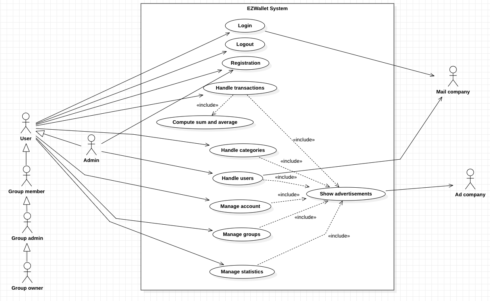

# Requirements Document - future EZWallet

Date: 

Version: V2 - description of EZWallet in FUTURE form (as proposed by the team)

 
| Version number | Change |
| ----------------- |:-----------|
| | | 

# Contents

- [Informal description](#informal-description)
- [Stakeholders](#stakeholders)
- [Context Diagram and interfaces](#context-diagram-and-interfaces)
	+ [Context Diagram](#context-diagram)
	+ [Interfaces](#interfaces) 
	
- [Stories and personas](#stories-and-personas)
- [Functional and non functional requirements](#functional-and-non-functional-requirements)
	+ [Functional Requirements](#functional-requirements)
	+ [Non functional requirements](#non-functional-requirements)
- [Use case diagram and use cases](#use-case-diagram-and-use-cases)
	+ [Use case diagram](#use-case-diagram)
	+ [Use cases](#use-cases)
    	+ [Relevant scenarios](#relevant-scenarios)
- [Glossary](#glossary)
- [System design](#system-design)
- [Deployment diagram](#deployment-diagram)

# Informal description
EZWallet (read EaSy Wallet) is a software application designed to help individuals and families keep track of their expenses. Users can enter and categorize their expenses, allowing them to quickly see where their money is going. EZWallet is a powerful tool for those looking to take control of their finances and make informed decisions about their spending.

# Stakeholders

| Stakeholder name  | Description | 
| ----------------- |:-----------|
|   User     | A person who benefits from the application services.| 
|   Admin     | Individual responsible for the proper user management of the application software.| 
| Development team | A group of developers whose purpose is software development, maintenance and provision of relative services.|
|   Supervisor     | Individual that monitors and judges the smooth running of the software production performed by the devolpment team.|
| Competitor   | Individual, organization or company that operates in the same industry of the software application and they may compete on various factors in order to gain a competitive advantage over the production of this software.| 
| Law regulators   | Entities or organization that are responsible for enforcing laws and regulations in order to ensure that the rights of consumers or other stakeholders are protected.| 
|   Mail company     | A business solution used for creating, sending and tracking mail automatically.| 
|   Ad company     | A digital advertisement company that allows website owners to monetize their online content by displaying targeted advertisements on their website. | 

# Context Diagram and interfaces

## Context Diagram
\<Define here Context diagram using UML use case diagram>

\<actors are a subset of stakeholders>

## Interfaces
\<describe here each interface in the context diagram>

\<GUIs will be described graphically in a separate document>

| Actor | Logical Interface | Physical Interface  |
| ------------- |:-------------:| :-----:|
|   User     | GUI | PC |
|   Admin     | GUI | PC |
|   Mail company     | APIs | Internet link  |
|   Ad company     | APIs | Internet link  |

# Stories and personas
\<A Persona is a realistic impersonation of an actor. Define here a few personas and describe in plain text how a persona interacts with the system>

\<Persona is-an-instance-of actor>

\<stories will be formalized later as scenarios in use cases>

Persona 1: 
Sara, 32 years old, she is a busy business professional. Single, workaholic, she is always in a hurry and has no time for anything else because her schedule is always full. She is always struggling with managing her personal finances.  
Story: 
Sara often found herself overspending and not knowing where her money was going. She signed up for an account and started adding transactions. Every time she made a purchase, she would log into the software and add the transaction, along with the category it belonged to. The software had the possibility for create new categories according to her need so she added some like groceries, entertainment, transportation, and more, which made it easy for Sara to categorize her expenses and see where her money was going.

Persona 2: 
Eric, 20 years old, he is an undergraduate student. He is trying to balance his studies with part-time job to make ends meet. He needs a web solution that helps him manage his finances by tracking his spending. 
Story: 
Eric goes out every weekend with friends and finds himself flat broke at the end of the month with rent left to pay. He found this app that tracks all his purchases so he can account on what he spends more on. He registered and every time he paid for something he added the relative transaction to the app. After a month of use, he noticed that he was spending more than he could afford and decided to give a cut with alchool since the app showed that it was the category on what he had spent the most.

Persona 3: 
Lorenzo, male, 47 years old. He is an important ambassador always on travelling for business purposes. He has 5 credit cards that he uses for both personal and business expenses.  
Story: 
Lorenzo sees his salary, extras and other earnings credited to multiple banking accounts and this makes it difficult for him to understand the total amount of expenditures that he makes. Moreover, sometimes he also gets refunded for some business expenses. Since he registered to EZWallet he could finally have a general overview of its movements. Everytime he wants, he logs into his account through the browser of his smartphone and adds a transaction with all the info and related category depending on whether the transaction is personal or business. If he gets refunded he can delete the affected transaction easily. For its ease of use and accuracy, the application meets Lorenzo's needs.

Persona 4: 
Fabiana is a single 25 years old woman and she shares the apartment in which she lives with 3 other girls. She is very careful about her buying habits since her budget is limited.  
Story: 
Splitting the household expenses between 4 people is not an easy task for Fabiana. She doesn't want to buy something that at that same time one of her roommates has already bought by chance and above all, she wants everyone to contribute more or less equally to the expenses. So she signed up to EZWallet and made her roomates register as well with their smartphones. She created a new group called "Household", invited to join the group her 3 roomates and promoted one to be group admin since of all she was the most organized. Within the group Fabiana and her roomates, for the sake of simplicity, decided to create 4 distinct categories each with a name of the girls. A transaction made by Fabiana, for example, would have been linked to the category "Fabiana". By doing so and with the use of statistics section offered by the website, all four girls now had a clearer view of who was spending more so that they could match each other's spending using common sense.

# Functional and non functional requirements

## Functional Requirements

\<In the form DO SOMETHING, or VERB NOUN, describe high level capabilities of the system>

\<they match to high level use cases>

| ID        | Description  |
| :------------- |:-------------| 
|  FR1    <ul><li>FR1.1</li><li>FR1.2</li><li>FR1.3</li><li>FR1.4</li><li>FR1.5</li></ul>   | Manage authentication for admin and users <ul><li>User can register</li><li>Admin can register through invitation link</li><li>Login</li><li>Logout</li><li>Password reset</li></ul>|
|  FR2  <ul><li>FR2.1</li><li>FR2.2</li><li>FR2.3</li><li>FR2.4</li><li>FR2.5</li><li>FR2.6</li><li>FR2.7</li><li>FR2.8</li></ul> |  Manage groups in which transactions are commonly shared between their members <ul><li>Show existing groups of which you're group owner, group admin or group member</li><li>Create a new group by automatically becoming its group owner setting a group name, color and currency.</li><li>Group admin and group owner can edit the relative existing group, changing its name, color and currency</li><li>Group owner can delete the relative owned group</li><li>Group admin and group owner can invite existing user to join the group</li><li>Group user can increase and decrease other group user's privilages according to the group user hierarchy</li><li>Group user can remove a group user according to the group user hierarchy</li><li>Group user can leave an existing group (if group owner, the system deletes the group).</li></ul>|
|  FR3  <ul><li>FR3.1</li><li>FR3.2</li><li>FR3.3</li><li>FR3.4</li><li>FR3.5</li><li>FR3.6</li></ul> |  Handle transactions <ul><li>Group user can create a transaction with name, date, amount and category type. If transaction is recurrent on daily, weekly or monthly basis, next transactions with same data will be inserted automatically.</li><li>Group user gets all existing transactions of the current month</li><li>The system performs the sum and average of transaction amounts</li><li>Group user can delete a transaction</li><li>Group user can edit a transaction. System displays all the stored changes</li><li>Group user can filter existing transactions by one or multiple categories and/or custom time period</li></ul>|
|  FR4  <ul><li>FR4.1</li><li>FR4.2</li><li>FR4.3</li><li>FR4.4</li></ul> |  Handle categories <ul><li>Group user can create a new category with name and selected color </li><li>Show the categories of the group</li><li>Group user can edit a category changing its name or color</li><li>Group user can delete a category. By the time of deletion, if there exist transactions related to that category, it is asked to delete them or to assign them all to an existing category </li></ul>|
|  FR5  <ul><li>FR5.1</li><li>FR5.2</li><li>FR5.3</li><li>FR5.4</li><li>FR5.5</li></ul> |  Handle users <ul><li>Show all existing users to admin</li><li>Admin can edit user's credentials and they can promote user to admin</li><li>Admin can create new user </li><li>Admin can delete a user</li><li>Admin can create an admin invitation link</li></ul>|
|  FR6  <ul><li>FR6.1</li><li>FR6.2</li><li>FR6.3</li></ul> |  Manage account <ul><li>User can read their user informations</li><li>User can edit their user informations and upload a profile picture </li><li>User can delete their account</li></ul>|
|  FR7  |  Group user can get statistics such as most expensive categories and month of a group with at least a transaction |
|  FR8  |  Show advertisements |

## Non Functional Requirements

\<Describe constraints on functional requirements>

| ID        | Type (efficiency, reliability, ..)           | Description  | Refers to |
| ------------- |:-------------:| :-----| -----:|
|  NFR1     |  Security | Access token should be limited to 1h starting from when user logged in | FR1|
|  NFR2     | Security| Refresh token should be limited to 7 days and it is stored and transmitted securely. |FR1 |
|  NFR3     | Security| The password has to be encrypted. |FR1.1,FR1.2,FR1.5,FR5.2,FR5.3|
|  NFR4     | Security| The password format must have a minimum length of 8 characters. |FR1.1,FR1.2,FR1.5,FR5.2,FR5.3 |
|  NFR5     | Security| The password should not be typed in plain-text. |FR1.1,FR1.2,FR1.3,FR1.5,FR5.2,FR5.3|
|  NFR6     | Security| The invitation link should expire after 24 hours by the creation and immediately after usage. |FR1.2,FR5.5|
|  NFR7     |Efficiency | The system should have a response time less then 0.5 sec.|FR1,FR2,FR3,FR4,FR5,FR6,FR7,FR8 |
|  NFR7     |Efficiency | The application must be able to support at least 500 concurrent users.|FR1,FR2,FR3,FR4,FR5,FR6,FR7,FR8 |
| NFR8 |Usability | The system should check the following format requirements for email address:  <ul><li>Allowed characters for acceptable email prefix are: letters (a-z), numbers, underscores, periods, and dashes. An underscore, period, or dash must be followed by one or more letter or number</li><li>The prefix must be followed by a '@' symbol</li><li>Domain must be followed by the '@' symbol. Allowed characters for acceptable domain are: letters, numbers, dashes.The last portion of the domain must end with a period followed by at least two characters</li></ul>| FR1.1,FR1.2,FR5.2,FR5.3| 
| NFR9 |Usability | At least 95% of non-technical users with more than 1 year of experience of using websites can determine what is the core features related to the website page they are on.| FR1,FR2,FR3,FR4,FR5,FR6,FR7,FR8| 
| NFR10 |Reliability | The system must perform without failure in 95 percent of use cases during a month.| FR1,FR2,FR3,FR4,FR5,FR6,FR7,FR8| 
| NFR11 |Reliability | At most one critical severity defect per year.| FR1,FR2,FR3,FR4,FR5,FR6,FR7| 
| NFR12 |Availability |The website must be available to users 99.97 percent of the time every month during business hours CEST.| FR1,FR2,FR3,FR4,FR5,FR6,FR7,FR8| 
| NFR13 |Portability |The website must be compatible with at least one of the latest 10 versions of the following browsers: Google Chrome, Microsoft Edge, Safari, Mozilla Firefox, Opera.| FR1,FR2,FR3,FR4,FR5,FR6,FR7,FR8| 

# Use case diagram and use cases

## Use case diagram
\<define here UML Use case diagram UCD summarizing all use cases, and their relationships>

\<next describe here each use case in the UCD>
### Use case 1, Login (UC1)
| Actors Involved        | User, Mail company |
| ------------- |:-------------:| 
|  Precondition     | User not logged in, user registered |
|  Post condition     | User logged in |
|  Nominal Scenario     | Scenario 1.1 |
|  Variants     | Scenario 1.6 |
|  Exceptions     | Scenario 1.2, 1.3, 1.4, 1.5 |

##### Scenario 1.1 

\<describe here scenarios instances of UC1>

\<a scenario is a sequence of steps that corresponds to a particular execution of one use case>

\<a scenario is a more formal description of a story>

\<only relevant scenarios should be described>

| Scenario 1.1 | Login |
| ------------- |:-------------:| 
|  Precondition     | User not logged in, user registered |
|  Post condition     | User logged in |
| Step#        | Description  |
|  1     | User: Open the login page. |  
|  2     | User: Provide email, password. |
|  3     | System: Get email, password. The cookie check confirms that the user is not logged in. |
|  4	 | System: Given email, find the user. |
|  5	 | System: Given the user, compare the password provided with the one saved. They match. |
|  6	 | System: Authorize the user |

##### Scenario 1.2

| Scenario 1.2 | Wrong password |
| ------------- |:-------------:| 
|  Precondition     | User not logged in, user registered |
|  Post condition     | User not logged in |
| Step#        | Description  |
|  1     | User: Open the login page. |  
|  2     | User: Provide email, password. |
|  3     | System: Get email, password. The cookie check confirms that the user is not logged in. |
|  4	 | System: Given email, find the user. |
|  5	 | System: Given the user, compare the password provided with the one saved. They don't match. Return an error message to explain the problem. |

##### Scenario 1.3

| Scenario 1.3 | User not registered |
| ------------- |:-------------:| 
|  Precondition     | User not logged in, user not registered |
|  Post condition     | User not logged in |
| Step#        | Description  |
|  1     | User: Open the login page. |  
|  2     | User: Provide email, password. |
|  3     | System: Get email, password. The cookie check confirms that the user is not logged in. |
|  4	 | System: Given email, find the user. User not found. |
|  5	 | System: Show an error message to explain the problem. |

##### Scenario 1.4

| Scenario 1.4 | User already logged in |
| ------------- |:-------------:| 
|  Precondition     | User logged in, user registered |
|  Post condition     | User logged in |
| Step#        | Description  |
|  1     | User: Open the login page. |  
|  2     | User: Provide email, password. |
|  3     | System: Get email, password. The cookie check shows that the user is already logged in. |
|  4	 | System: Return an error message to explain the problem. |

##### Scenario 1.5

| Scenario 1.5 | Missing data |
| ------------- |:-------------:| 
|  Precondition     | None |
|  Post condition     | Error |
| Step#        | Description  |
|  1     | User: Open the login page. |  
|  2     | User: Don't provide email or password. |
|  3     | System: Get email, password. Notice that some data is missing. |
|  4	 | System: Return an error message to explain the problem. |

##### Scenario 1.6

| Scenario 1.6 | Password forgotten |
| ------------- |:-------------:| 
|  Precondition     | User not logged in, user registered |
|  Post condition     | Password recovered |
| Step#        | Description  |
|  1     | User: Open the login page. |  
|  2     | User: Click on "forgot password" button. |
|  3     | User: Provide the email of the account. |
|  4	 | System: Given email, find the user. User found. |
|  5	 | System: Create a link to reset the password, create the email body. |
|  6	 | Mail company: Send the email to the provided address. |
|  7     | User: Open the email, click on the link. Create a new password that respects the requirements. |
|  8     | System: Retrieve the new password, check that it satisfies the requirements. Update user information. |
|  9	 | System: Show a confirmation message. |

### Use case 2, Logout (UC2)

| Actors Involved        | User |
| ------------- |:-------------:| 
|  Precondition     | User logged in |
|  Post condition     | User not logged in |
|  Nominal Scenario     | Scenario 2.1 |
|  Variants     | Scenario 2.2 |
|  Exceptions     | Scenario 2.3, 2.4 |

##### Scenario 2.1 

| Scenario 2.1 | Logout through button |
| ------------- |:-------------:| 
|  Precondition     | User logged in |
|  Post condition     | User not logged in |
| Step#        | Description  |
|  1     | User: Open the homepage of EZWallet. |  
|  2     | System: Check that the user isn't already logged out. |
|  3     | User: Click on logout button. |
|  4     | System: Find the user. |
|  5	 | System: Update user information (remove authorization to the user device). |
|  6	 | System: Show a logout confirmation message. |

##### Scenario 2.2 

| Scenario 2.2 | Logout through address |
| ------------- |:-------------:| 
|  Precondition     | User logged in |
|  Post condition     | User not logged in |
| Step#        | Description  |
|  1     | User: Go to /logout address. |
|  2     | System: Check that the user isn't already logged out. |
|  3     | System: Find the user. |
|  4	 | System: Update user information (remove authorization to the user device). |
|  5	 | System: Show a logout confirmation message. |

##### Scenario 2.3 

| Scenario 2.3 | User already logged out |
| ------------- |:-------------:| 
|  Precondition     | User not logged in |
|  Post condition     | User not logged in |
| Step#        | Description  |
|  1     | User: Go to /logout address. |  
|  2     | System: Check that the user isn't already logged out. |
|  3     | System: User hasn't performed login yet. Display an error message. |

##### Scenario 2.4 

| Scenario 2.4 | The user doesn't exist |
| ------------- |:-------------:| 
|  Precondition     | None |
|  Post condition     | Error |
| Step#        | Description  |
|  1     | User: Go to /logout address. |
|  2     | System: Check that the user isn't already logged out. |
|  3     | System: Find the user. |
|  4	 | System: User not found, show an error message. |

### Use case 3, Registration (UC3)

| Actors Involved        | User, Admin |
| ------------- |:-------------:| 
|  Precondition     | The user doesn't have an account |
|  Post condition     | User registered |
|  Nominal Scenario     | Scenario 3.1 |
|  Variants     | Scenario 3.3 |
|  Exceptions     | Scenario 3.2, 3.4, 3.5 |

##### Scenario 3.1 

| Scenario 3.1 | Registration |
| ------------- |:-------------:| 
|  Precondition     | The user doesn't have an account |
|  Post condition     | User registered |
| Step#        | Description  |
|  1     | User: Open the login page of EZWallet. |  
|  2     | User: Click on register button. |
|  3     | User: Provide username, email, password. |
|  4     | System: Retrieve username, email, password. Check if the email provided has a valid format and if the password respects the security requirements. |
|  5     | System: Check that the provided email and username isn't associated with any account yet. The email and username hasn't been used yet. |
|  6     | System: Create a new user and store his information (encrypt in some way the password). Assign to him the default profile picture. |
|  7	 | System: Show a registration confirmation message. |

##### Scenario 3.2 

| Scenario 3.2 | User/admin already registered |
| ------------- |:-------------:| 
|  Precondition     | The user/admin has an account |
|  Post condition     | Registration failed |
| Step#        | Description  |
|  1     | User: Open the login page of EZWallet. |  
|  2     | User: Click on register button. |
|  3     | User: Provide username, email, password. |
|  4     | System: Retrieve username, email, password. Check if the email provided has a valid format and if the password respects the security requirements. |
|  5     | System: Check that the provided email and username aren't associated with any account yet. The email or username has already been used. |
|  6	 | System: Show an error message. |

##### Scenario 3.3 

| Scenario 3.3 | Admin registration |
| ------------- |:-------------:| 
|  Precondition     | The admin doesn't have an account |
|  Post condition     | Admin registered |
| Step#        | Description  |
|  1     | Admin: Open the invitation link. |  
|  2     | System: Check that the invitation link is valid. It's valid. |
|  3     | Admin: Provide username, email, password. |
|  4     | System: Retrieve username, email, password. Check if the email provided has a valid format and if the password respects the security requirements. |
|  5     | System: Check that the provided email isn't associated with any account yet. The email hasn't been used yet. |
|  6     | System: Create a new user and store his information (encrypt in some way the password). Grant to the user admin privileges. Assign to him the default profile picture. |
|  7	 | System: Show a registration confirmation message. |

##### Scenario 3.4 

| Scenario 3.4 | Wrong data format |
| ------------- |:-------------:| 
|  Precondition     | The user/admin doesn't have an account |
|  Post condition     | Registration failed |
| Step#        | Description  |
|  1     | User: Open the login page of EZWallet. |  
|  2     | User: Click on register button. |
|  3     | User: Provide username, email, password. Password and/or email have a wrong format. |
|  4     | System: Retrieve username, email, password. Email or password have a wrong format. |
|  5	 | System: Show an error message. |

##### Scenario 3.5 

| Scenario 3.5 | Admin link already used or invalid |
| ------------- |:-------------:| 
|  Precondition     | The admin doesn't have an account |
|  Post condition     | Error |
| Step#        | Description  |
|  1     | Admin: Open the invitation link. |  
|  2     | System: The invitation link has already been used or is invalid. |
|  3	 | System: Show an error message. |

### Use case 4, Handle transactions (UC4)

| Actors Involved        | User, Ad company |
| ------------- |:-------------:| 
|  Precondition     | The user is logged in, the user belongs to the group |
|  Post condition     | Transaction inserted/deleted/edited/shown |
|  Nominal Scenario     | Scenario 4.1, 4.2, 4.3, 4.6 |
|  Variants     | Scenario 4.5, 4.7, 4.9 |
|  Exceptions     | Scenario 4.4, 4.8 |

We didn't insert a scenario where the user provides data in a wrong format since it can't happen. In fact, for what concerns category the user picks it from a drop down menu, while for the other fields the data can be provided only with a specific format (enforced by the input type), and thus errors shouldn't happen.

##### Scenario 4.1 

| Scenario 4.1 | Insert non recurrent transaction |
| ------------- |:-------------:| 
|  Precondition     | The user is logged in, the user belongs to the group |
|  Post condition     | Transaction inserted |
| Step#        | Description  |
|  1     | User: Open the homepage of EZWallet. |  
|  2     | System: Check if the user is logged in. |
|  3     | User: Select the desired group. |  
|  4     | System: Check if the user belongs to the group. |
|  5     | System: Given the group, retrieve all the transactions in the current month and show them. Show advertisements. |
|  6     | System: Compute sum and average for the current month. Show them. |
|  7     | User: Insert in the proper fields name, date, amount and category of the transaction. Don't click on recurrent checkbox. |
|  8     | User: Click on the button to create a transaction. |
|  9     | System: Retrieve name, date, amount and category. |
|  10    | System: Create a new transaction for the group and store its information. |
|  11	 | System: Show the new transaction among the others. Recompute sum and average.  |

##### Scenario 4.2

| Scenario 4.2 | Get the existing transactions |
| ------------- |:-------------:| 
|  Precondition     | The user is logged in, the user belongs to the group |
|  Post condition     | Transactions shown |
| Step#        | Description  |
|  1     | User: Open the homepage of EZWallet. |  
|  2     | System: Check if the user is logged in. |
|  3     | User: Select the desired group. | 
|  4     | System: Check if the user belongs to the group. | 
|  5     | System: Given the group, retrieve all the transactions in the current month and show them. Show advertisements. |
|  6     | System: Compute sum and average for the current month. Show them. |

##### Scenario 4.3

| Scenario 4.3 | Delete a transaction |
| ------------- |:-------------:| 
|  Precondition     | The user is logged in, the user belongs to the group |
|  Post condition     | Transaction deleted |
| Step#        | Description  |
|  1     | User: Open the homepage of EZWallet. |  
|  2     | System: Check if the user is logged in. |
|  3     | User: Select the desired group. |  
|  4     | System: Check if the user belongs to the group. |
|  5     | System: Given the group, retrieve all the transactions in the current month and show them. Show advertisements. |
|  6     | System: Compute sum and average for the current month. Show them. |
|  7     | User: Find the desired transaction and click on it. |
|  8     | System: Retrieve the transaction details and allow the user to edit them. Show to the user the history of changes. |
|  9     | User: Click on delete button. |
|  10    | System: Retrieve the transaction ID and delete it. If it's recurrent, delete all the other instances of the transaction and delete the scheduled future insertions. |
|  11    | System: Show a confirmation message, remove the transaction from the displayed ones. Recompute sum and average. |

##### Scenario 4.4

| Scenario 4.4 | User not logged in |
| ------------- |:-------------:| 
|  Precondition     | The user is not logged in |
|  Post condition     | Error |
| Step#        | Description  |
|  1     | User: Open the homepage of EZWallet. |
|  2     | System: Check if the user is logged in. The user isn't logged in. |
|  3	 | System: Show an error message. |

##### Scenario 4.5

| Scenario 4.5 | Missing data |
| ------------- |:-------------:| 
|  Precondition     | The user is not logged in, the user belongs to the group |
|  Post condition     | Transaction inserted |
| Step#        | Description  |
|  1     | User: Open the homepage of EZWallet. |  
|  2     | System: Check if the user is logged in. |
|  3     | User: Select the desired group. | 
|  4     | System: Check if the user belongs to the group. | 
|  5     | System: Given the group, retrieve all the transactions in the current month and show them. Show advertisements. |
|  6     | System: Compute sum and average for the current month. Show them. |
|  7     | User: Insert in the proper fields name, date, amount, if it's recurrent (if so with which frequency) and category of the transaction. Leave some/all fields blank. |
|  8     | User: Click on the button to create a transaction. |
|  9     | System: Retrieve name, date, amount, if it's recurrent (if so with which frequency) and category. For missing data, insert some default values. |
|  10    | System: Create a new transaction for the group and store its information. |
|  11	 | System: Show the new transaction among the others. Recompute sum and average. |

##### Scenario 4.6 

| Scenario 4.6 | Edit transaction |
| ------------- |:-------------:| 
|  Precondition     | The user is logged in, the user belongs to the group |
|  Post condition     | Transaction edited |
| Step#        | Description  |
|  1     | User: Open the homepage of EZWallet. |  
|  2     | System: Check if the user is logged in. |
|  3     | User: Select the desired group. |  
|  4     | System: Check if the user belongs to the group. |
|  5     | System: Given the group, retrieve all the transactions in the current month and show them. Show advertisements. |
|  6     | System: Compute sum and average for the current month. Show them. |
|  7     | User: Find the desired transaction and click on it. |
|  8     | System: Retrieve the transaction details and allow the user to edit them. Show to the user the history of changes. |
|  9     | User: Update the desired field(s). |
|  10    | User: Click on the button to save the changes. |
|  11    | System: Retrieve name, date, amount, if it's recurrent (if so with which frequency) and category. If the recurrent option was active and now it's disabled, remove all the other transaction instances. |
|  12    | System: Store the changes of the transaction. If it's recurrent, propagate the changes to all the other instances of the transaction (and if necessary reschedule the transaction insertion with the new frequency). |
|  13	 | System: Show the updated transaction. Recompute sum and average. |

##### Scenario 4.7

| Scenario 4.7 | Filter existing transactions |
| ------------- |:-------------:| 
|  Precondition     | The user is logged in, the user belongs to the group |
|  Post condition     | Transactions shown |
| Step#        | Description  |
|  1     | User: Open the homepage of EZWallet. |  
|  2     | System: Check if the user is logged in. |
|  3     | User: Select the desired group. |  
|  4     | System: Check if the user belongs to the group. |
|  5     | System: Given the group, retrieve all the transactions in the current month and show them. Show advertisements. |
|  6     | System: Compute sum and average for the current month. Show them. |
|  7     | User: Edit visualization filters (categories shown and/or time period considered). |  
|  8     | System: Retrieve all the transactions with the updated filters and show them. Show advertisements. |
|  9     | System: Recompute sum and average for the current filters. |

##### Scenario 4.8

| Scenario 4.8 | User not belonging to the group |
| ------------- |:-------------:| 
|  Precondition     | The user is logged in, the user doesn't belong to the group |
|  Post condition     | Error |
| Step#        | Description  |
|  1     | User: Open the homepage of EZWallet. |  
|  2     | System: Check if the user is logged in. |
|  3     | User: Somehow selects a group to which he doesn't belong (through url,...). |  
|  4     | System: Check if the user belongs to the group. He doesn't belong to the group. |
|  5     | System: Show an error message. |

##### Scenario 4.9 

| Scenario 4.9 | Insert recurrent transaction |
| ------------- |:-------------:| 
|  Precondition     | The user is logged in, the user belongs to the group |
|  Post condition     | Transaction inserted, transaction insertion scheduled |
| Step#        | Description  |
|  1     | User: Open the homepage of EZWallet. |  
|  2     | System: Check if the user is logged in. |
|  3     | User: Select the desired group. |  
|  4     | System: Check if the user belongs to the group. |
|  5     | System: Given the group, retrieve all the transactions in the current month and show them. Show advertisements. |
|  6     | System: Compute sum and average for the current month. Show them. |
|  7     | User: Insert in the proper fields name, date, amount and category of the transaction. Click on recurrent checkbox and select the frequency (daily, weekly or monthly). |
|  8     | User: Click on the button to create a transaction. |
|  9     | System: Retrieve name, date, amount and category. |
|  10    | System: Create a new transaction for the group and store its information. Schedule a transaction creation with the provided frequency. |
|  11	 | System: Show the new transaction among the others. Recompute sum and average.  |

### Use case 5, Handle categories (UC5)

| Actors Involved        | User, Ad company |
| ------------- |:-------------:| 
|  Precondition     | The user is logged in, the user belongs to the group |
|  Post condition     | Category inserted/shown/edited/deleted |
|  Nominal Scenario     | Scenario 5.1, 5.2, 5.5, 5.6 |
|  Variants     | Scenario 5.4, 5.7 |
|  Exceptions     | Scenario 5.3, 5.8, 5.9 |

For categories, it's not necessary to implement checks on input since the name is just a string and the color is chosen through a color picker, so it's impossible to have errors.

##### Scenario 5.1 

| Scenario 5.1 | Insert category |
| ------------- |:-------------:| 
|  Precondition     | The user is logged in, the user belongs to the group |
|  Post condition     | Category inserted |
| Step#        | Description  |
|  1     | User: Open the category page of a given group. |  
|  2     | System: Check if the user is logged in and if he belongs to the group. |
|  3     | System: Retrieve all the categories of the group and show them. Show advertisements. |
|  4	 | User: Click on insert category button. |
|  5     | User: Insert category type and pick the desired color. |
|  6     | User: Click on save button. |
|  7     | System: Retrieve type and color. Check that the type is unique (i.e. there's not another category with the same type). |
|  8     | System: Create a new category and store its information. |
|  9	 | System: Show the new category among the others. |

##### Scenario 5.2

| Scenario 5.2 | Get categories |
| ------------- |:-------------:| 
|  Precondition     | The user is logged in, the user belongs to the group |
|  Post condition     | Categories shown |
| Step#        | Description  |
|  1     | User: Open the category page of a given group. |  
|  2     | System: Check if the user is logged in and if he belongs to the group. |
|  3     | System: Retrieve all the categories of the group and show them. Show advertisements. |

##### Scenario 5.3

| Scenario 5.3 | User not logged in |
| ------------- |:-------------:| 
|  Precondition     | The user is not logged in |
|  Post condition     | Error |
| Step#        | Description  |
|  1     | User: Open the category page of a given group. |
|  2     | System: Check if the user is logged in. The user isn't logged in. |
|  3	 | System: Show an error message. |

##### Scenario 5.4

| Scenario 5.4 | Missing data |
| ------------- |:-------------:| 
|  Precondition     | The user is logged in, the user belongs to the group |
|  Post condition     | Category inserted |
| Step#        | Description  |
|  1     | User: Open the category page of a given group. |  
|  2     | System: Check if the user is logged in and if he belongs to the group. |
|  3     | System: Retrieve all the categories and show them. |
|  4	 | User: Click on insert category button. |
|  5     | User: Insert category type and pick the desired color. Leave type and/or color blank. |
|  6     | User: Click on save button. |
|  7     | System: Retrieve type and color. |
|  8     | System: Create a new category and store its information. In case of mising data, use default values. |
|  9	 | System: Show the new category among the others. |

##### Scenario 5.5 

| Scenario 5.5 | Edit a category |
| ------------- |:-------------:| 
|  Precondition     | The user is logged in, the user belongs to the group |
|  Post condition     | Category edited |
| Step#        | Description  |
|  1     | User: Open the category page of a given group. |  
|  2     | System: Check if the user is logged in and if he belongs to the group. |
|  3     | System: Retrieve all the categories of the group and show them. Show advertisements. |
|  4	 | User: Click on the desired category. |
|  5     | System: Retrieve category details and show them. Show all the transactions related to that category. |
|  6	 | User: Click on edit button. |
|  7     | System: Allow the editing of the fields. |
|  8     | User: Edit category name and/or color. |
|  9     | User: Click on save button. |
|  10    | System: Retrieve updated type and color. Check that the type is unique (i.e. there's not another category with the same type). |
|  11    | System: Store the updated category information. |
|  12	 | System: Show the updated category among the others. |

##### Scenario 5.6 

| Scenario 5.6 | Delete a category and its transactions |
| ------------- |:-------------:| 
|  Precondition     | The user is logged in, the user belongs to the group |
|  Post condition     | Category deleted |
| Step#        | Description  |
|  1     | User: Open the category page of a given group. |  
|  2     | System: Check if the user is logged in and if he belongs to the group. |
|  3     | System: Retrieve all the categories of the group and show them. Show advertisements. |
|  4	 | User: Click on the desired category. |
|  5     | System: Retrieve category details and show them. Show all the transactions related to that category. |
|  6	 | User: Click on delete button. |
|  7     | System: Ask to the user what he wants to do with the transactions related to that category. |
|  6	 | User: Click on "delete transactions" button. |
|  8	 | System: Delete the category and all its transactions. Show the updated category page. |

##### Scenario 5.7 

| Scenario 5.7 | Delete a category, assign its transactions to another category |
| ------------- |:-------------:| 
|  Precondition     | The user is logged in, the user belongs to the group |
|  Post condition     | Category deleted |
| Step#        | Description  |
|  1     | User: Open the category page of a given group. |  
|  2     | System: Check if the user is logged in and if he belongs to the group. |
|  3     | System: Retrieve all the categories of the group and show them. Show advertisements. |
|  4	 | User: Click on the desired category. |
|  5     | System: Retrieve category details and show them. Show all the transactions related to that category. |
|  6	 | User: Click on delete button. |
|  7     | System: Ask to the user what he wants to do with the transactions related to that category. |
|  6	 | User: Select the new category for the transactions. |
|  8	 | System: Delete the category and update the category of its transactions. Show the updated category page. |

##### Scenario 5.8

| Scenario 5.8 | User not belonging to the group |
| ------------- |:-------------:| 
|  Precondition     | The user is logged in, the user doesn't belong to the group |
|  Post condition     | Error |
| Step#        | Description  |
|  1     | User: Somehow opens the category page of a group to which he doesn't belong. |  
|  2     | System: Check if the user is logged in and if he belongs to the group. He doesn't belong to the group. |
|  3     | System: Show an error message. |

##### Scenario 5.9 

| Scenario 5.9 | Category type already used |
| ------------- |:-------------:| 
|  Precondition     | The user is logged in, the user belongs to the group |
|  Post condition     | Category not inserted |
| Step#        | Description  |
|  1     | User: Open the category page of a given group. |  
|  2     | System: Check if the user is logged in and if he belongs to the group. |
|  3     | System: Retrieve all the categories of the group and show them. Show advertisements. |
|  4	 | User: Click on insert category button. |
|  5     | User: Insert category type and pick the desired color. |
|  6     | User: Click on save button. |
|  7     | System: Retrieve type and color. Check that the type is unique (i.e. there's not another category with the same type). The type is already used. |
|  8	 | System: Show an error message. |

The scenario 5.9 can be replicated for the edit case. We won't explicitly report it since it would be redundant.

### Use case 6, Handle users (UC6)

| Actors Involved        | Admin, Ad company, Mail company |
| ------------- |:-------------:| 
|  Precondition     | Admin logged in |
|  Post condition     | User(s) shown/edited/deleted/inserted, Admin invitation created, User promoted to admin |
|  Nominal Scenario     | Scenario 6.1, 6.3, 6.4, 6.5, 6.6, 6.7 |
|  Variants     | None |
|  Exceptions     | Scenario 6.2 |

##### Scenario 6.1 

| Scenario 6.1 | Get users |
| ------------- |:-------------:| 
|  Precondition     | Admin logged in |
|  Post condition     | Users shown |
| Step#        | Description  |
|  1     | Admin: Open the management tab. |  
|  2     | System: Check if the user is logged in and if he has admin privileges. |
|  3     | System: Retrieve the list of all users and show it. Show advertisements. |

##### Scenario 6.2 

| Scenario 6.2 | Standard user tries to get users information |
| ------------- |:-------------:| 
|  Precondition     | User logged in |
|  Post condition     | Error |
| Step#        | Description  |
|  1     | User: Somehow open the management tab (through /user url, ...). |  
|  2     | System: Check if the user is logged in and if he has admin privileges. He hasn't admin privileges. |
|  3     | System: Show an error message. |

##### Scenario 6.3

| Scenario 6.3 | Edit user information |
| ------------- |:-------------:| 
|  Precondition     | Admin logged in |
|  Post condition     | User edited |
| Step#        | Description  |
|  1     | Admin: Open the management tab. |  
|  2     | System: Check if the user is logged in and if he has admin privileges. |
|  3     | System: Retrieve the list of all users and show it. Show advertisements. |
|  4     | Admin: Click on edit button for a given user. |  
|  5     | System: Retrieve user information and show them in editing mode. Don't show the password. |
|  6     | Admin: Update some of the fields. Click on save button. |
|  7     | System: Retrieve updated fields. Check if input format satisfies the requirements (as seen in register scenario). Check if email and username are unique. |
|  8     | System: Update user information. Show a confirmation message. |

##### Scenario 6.4

| Scenario 6.4 | Delete user |
| ------------- |:-------------:| 
|  Precondition     | Admin logged in |
|  Post condition     | User deleted |
| Step#        | Description  |
|  1     | Admin: Open the management tab. |  
|  2     | System: Check if the user is logged in and if he has admin privileges. |
|  3     | System: Retrieve the list of all users and show it. Show advertisements. |
|  4     | Admin: Click on delete button for a given user. |  
|  5     | System: Retrieve user. Remove him from all the groups to which he belongs. Delete him. |
|  8     | System: Show a confirmation message. |

##### Scenario 6.5

| Scenario 6.5 | Insert user |
| ------------- |:-------------:| 
|  Precondition     | Admin logged in |
|  Post condition     | User inserted |
| Step#        | Description  |
|  1     | Admin: Open the management tab. |  
|  2     | System: Check if the user is logged in and if he has admin privileges. |
|  3     | System: Retrieve the list of all users and show it. Show advertisements. |
|  4     | Admin: Click on insert button. |  
|  5     | System: Show insertion mode. |
|  6     | Admin: Provide username, email, password. Click on save button. |
|  7     | System: Retrieve username, email, password. Check if input format satisfies the requirements (as seen in register scenario). Check if email and password are unique. |
|  8     | System: Insert user. Show a confirmation message. |

Since the exceptions that can occur during insertion or editing are the same ones seen for registration (email or username already used, wrong input format, ...) we won't report them again for the sake of brevity.

##### Scenario 6.6

| Scenario 6.6 | Create admin invitation link |
| ------------- |:-------------:| 
|  Precondition     | Admin logged in |
|  Post condition     | Admin invitation link sent |
| Step#        | Description  |
|  1     | Admin: Open the management tab. |  
|  2     | System: Check if the user is logged in and if he has admin privileges. |
|  3     | System: Retrieve the list of all users and show it. Show advertisements. |
|  4     | Admin: Click on "invite admin" button. |  
|  6     | Admin: Provide the email of the new admin. Click on send button. |
|  7     | System: Check that the email format is valid. Create email body. Create a valid invitation link and include it in the body. |
|  8     | Mail company: Send the email to the provided address. |
|  8     | System: Show a confirmation message. |

##### Scenario 6.7

| Scenario 6.7 | Promote user to admin |
| ------------- |:-------------:| 
|  Precondition     | Admin logged in |
|  Post condition     | User promoted to admin |
| Step#        | Description  |
|  1     | Admin: Open the management tab. |  
|  2     | System: Check if the user is logged in and if he has admin privileges. |
|  3     | System: Retrieve the list of all users and show it. Show advertisements. |
|  4     | Admin: Click on edit button for a given user. |  
|  5     | System: Retrieve user information and show them in editing mode. Don't show the password. |
|  4     | Admin: Click on "promote to admin" button. |  
|  5     | System: Retrieve user information and check that the selected user is not an admin yet. |
|  6     | System: Grant to the user admin privileges. |
|  7     | System: Show a confirmation message. |

### Use case 7, Manage account (UC7)

| Actors Involved        | User, Ad company |
| ------------- |:-------------:| 
|  Precondition     | User logged in |
|  Post condition     | User information shown/updated/deleted |
|  Nominal Scenario     | Scenario 7.1, 7.5, 7.6, 7.7 |
|  Variants     | None |
|  Exceptions     | Scenario 7.2, 7.3, 7.4 |

##### Scenario 7.1

| Scenario 7.1 | Get user information |
| ------------- |:-------------:| 
|  Precondition     | The user is logged in |
|  Post condition     | User information shown |
| Step#        | Description  |
|  1     | User: Click on user management tab. |  
|  2     | System: Check if the user is logged in. |
|  3     | System: Retrieve the details about the user that's performing the request. |
|  4     | System: Check if the username provided matches with the user's one. They match. |
|  5     | System: Show user information. Show advertisements. |

##### Scenario 7.2

| Scenario 7.2 | User not logged in |
| ------------- |:-------------:| 
|  Precondition     | The user is not logged in |
|  Post condition     | Error |
| Step#        | Description  |
|  1     | User: Click on user management tab. |  
|  2     | System: Check if the user is logged in. The user isn't logged in. |
|  3     | System: Show an error message. |

##### Scenario 7.3

| Scenario 7.3 | User not found |
| ------------- |:-------------:| 
|  Precondition     | The user is not logged in |
|  Post condition     | Error |
| Step#        | Description  |
|  1     | User: Click on user management tab. Somehow provide as parameter a username that doesn't belong to anyone. |  
|  2     | System: Check if the user is logged in. |
|  3     | System: Retrieve the details about the user that's performing the request. User not found. |
|  4     | System: Show an error message. |

##### Scenario 7.4

| Scenario 7.4 | The username provided is wrong |
| ------------- |:-------------:| 
|  Precondition     | The user is logged in |
|  Post condition     | Error |
| Step#        | Description  |
|  1     | User: Clicks on user management tab. Somehow provides as parameter a username different than his one. |  
|  2     | System: Check if the user is logged in. |
|  3     | System: Retrieve the details about the user that's performing the request. |
|  4     | System: Check if the username provided matches with the user's one. They don't match. |
|  5     | System: Show an error message. |

##### Scenario 7.5

| Scenario 7.5 | Edit user information |
| ------------- |:-------------:| 
|  Precondition     | The user is logged in |
|  Post condition     | User information edited |
| Step#        | Description  |
|  1     | User: Click on user management tab. |  
|  2     | System: Check if the user is logged in. |
|  3     | System: Retrieve the details about the user that's performing the request. |
|  4     | System: Check if the username provided matches with the user's one. They match. |
|  5     | System: Show user information. Show advertisements. |
|  6     | User: Click on edit button. |
|  7     | System: Show user information in editing mode. |
|  8     | User: Update fields. Click on save button. |
|  9     | System: Check if input format is correct. Store the updated information. |
|  10    | System: Show the updated information. |

##### Scenario 7.6

| Scenario 7.6 | Delete user |
| ------------- |:-------------:| 
|  Precondition     | The user is logged in |
|  Post condition     | User information edited |
| Step#        | Description  |
|  1     | User: Click on user management tab. |  
|  2     | System: Check if the user is logged in. |
|  3     | System: Retrieve the details about the user that's performing the request. |
|  4     | System: Check if the username provided matches with the user's one. They match. |
|  5     | System: Show user information. Show advertisements. |
|  6     | User: Click on "delete account" button. |
|  7     | System: Remove him from all the groups to which he belongs. Delete the user. |
|  8     | System: Show a confirmation message. |

##### Scenario 7.7

| Scenario 7.7 | Upload a profile picture |
| ------------- |:-------------:| 
|  Precondition     | The user is logged in |
|  Post condition     | User profile picture inserted/updated |
| Step#        | Description  |
|  1     | User: Click on user management tab. |  
|  2     | System: Check if the user is logged in. |
|  3     | System: Retrieve the details about the user that's performing the request. |
|  4     | System: Check if the username provided matches with the user's one. They match. |
|  5     | System: Show user information. Show advertisements. |
|  6     | User: Click on the button to upload a profile picture. Select the picture. |
|  7     | System: Store the updated profile picture. |
|  8     | System: Show the updated information. |

### Use case 8, Show advertisements (UC8)

| Actors Involved        | User, Ad company |
| ------------- |:-------------:| 
|  Precondition     | Any page shown |
|  Post condition     | Advertisements shown |
|  Nominal Scenario     | Scenario 8.1 |
|  Variants     | None |
|  Exceptions     | Scenario 8.2 |

##### Scenario 8.1

| Scenario 8.1 | Show advertisements |
| ------------- |:-------------:| 
|  Precondition     | Any page shown  |
|  Post condition     | Advertisements shown |
| Step#        | Description  |
|  1     | User: Open any page of EZWallet. |  
|  2     | System: Display the page. Ask to the ad company the advertisements. |
|  3     | Ad company: Provide the advertisements. |
|  4     | System: Display the advertisements on the page. |

##### Scenario 8.2

| Scenario 8.2 | Advertisements retrieval failed |
| ------------- |:-------------:| 
|  Precondition     | Any page shown  |
|  Post condition     | Advertisements retrieval failed |
| Step#        | Description  |
|  1     | User: Open any page of EZWallet. |  
|  2     | System: Display the page. Ask to the ad company the advertisements. |
|  3     | System: Advertisements retrieval failed. |
|  4     | System: Advertisements not shown. |

Since the error can be caused by many factors (problems on EZWallet side, on Ad company side, ...) and since they are too implementation dependent it's not interesting to analyze them, and thus we just reported a generic error scenario.

### Use case 9, Compute sum and average (UC9)

| Actors Involved        | User |
| ------------- |:-------------:| 
|  Precondition     | Transactions shown |
|  Post condition     | Sum and average shown |
|  Nominal Scenario     | Scenario 9.1 |
|  Variants     | Scenario 9.2 |
|  Exceptions     | None |

##### Scenario 9.1

| Scenario 9.1 | Sum and average computation |
| ------------- |:-------------:| 
|  Precondition     | Transactions shown  |
|  Post condition     | Sum and average shown |
| Step#        | Description  |
|  1     | User: Open any page of EZWallet containing transactions. |  
|  2     | System: Given the transactions compute the sum of all the amounts. |
|  3     | System: Given the transactions compute the average cost of a transaction. |
|  4     | System: Show sum and average. |

### Use case 10, Manage groups (UC10)

| Actors Involved        | User, Group owner/creator, Ad company |
| ------------- |:-------------:| 
|  Precondition     | Group not existing |
|  Post condition     | Group created, member added/removed, member privileges changed |
|  Nominal Scenario     | Scenario 10.1, 10.2, 10.3, 10.4, 10.5, 10.6, 10.8, 10.11 |
|  Variants     | Scenario 10.9, 10.10 |
|  Exceptions     | Scenario 10.7 |

##### Scenario 10.1

| Scenario 10.1 | Group creation |
| ------------- |:-------------:| 
|  Precondition     | Group not existing  |
|  Post condition     | Group created |
| Step#        | Description  |
|  1     | User: Open the homepage of EZWallet. |  
|  2     | System: Check if the user is logged in. |
|  3     | User: Click on "create group" button. |
|  4     | System: Show group creation page. Show advertisements. |
|  5     | User: Provide group name, color and currency. Click on create button. |
|  6     | System: Retrieve group information. Create group. Set the user as group owner. |
|  7     | System: Show a confirmation message. |

##### Scenario 10.2

| Scenario 10.2 | Edit group |
| ------------- |:-------------:| 
|  Precondition     | Group existing  |
|  Post condition     | Group updated |
| Step#        | Description  |
|  1     | Group admin/owner: Open the homepage of EZWallet. |  
|  2     | System: Check if the user is logged in. Retrieve all the groups to which the user belongs and display them with the correct visualization (show edit button only if he is the owner or a group admin). Show advertisements. |
|  3     | Group admin/owner: Select the desired group. Click on edit button. |
|  4     | System: Show group management tab. Show advertisements. |
|  3     | Group admin/owner: Update the desired fields. Click on save button. |
|  4     | System: Retrieve the updated fields. Store the modifications. |
|  4     | System: Show a confirmation message. |

##### Scenario 10.3

| Scenario 10.3 | Delete group |
| ------------- |:-------------:| 
|  Precondition     | Group existing  |
|  Post condition     | Group deleted |
| Step#        | Description  |
|  1     | Group owner: Open the homepage of EZWallet. |  
|  2     | System: Check if the user is logged in. Retrieve all the groups to which the user belongs and display them with the correct visualization (show edit button only if he is the owner or a group admin). Show advertisements. |
|  3     | Group owner: Select the desired group. Click on edit button. |
|  4     | System: Show group management tab. If the user is the group owner, show a delete button too. Show advertisements. |
|  5     | Group owner: Click on delete button. |
|  6     | System: Delete the group and all its categories and transactions. |
|  7     | System: Show a confirmation message. |

##### Scenario 10.4

| Scenario 10.4 | Add user |
| ------------- |:-------------:| 
|  Precondition     | Group existing  |
|  Post condition     | User added |
| Step#        | Description  |
|  1     | Group admin/owner: Open the homepage of EZWallet. |  
|  2     | System: Check if the user is logged in. Retrieve all the groups to which the user belongs and display them with the correct visualization (show edit button only if he is the owner or a group admin). Show advertisements. |
|  3     | Group admin/owner: Select the desired group. Click on edit button. |
|  4     | System: Show group management tab. Show advertisements. |
|  5     | Group admin/owner: Provide the email of the user that will be added and his role (member or admin) in the proper section. |
|  6     | System: Search for the user. User found. Add the user to the group with the correct privileges. |
|  7     | System: Show a confirmation message. |

##### Scenario 10.5

| Scenario 10.5 | Handle group member privileges |
| ------------- |:-------------:| 
|  Precondition     | Group existing  |
|  Post condition     | Member privileges update |
| Step#        | Description  |
|  1     | Group admin/owner: Open the homepage of EZWallet. |  
|  2     | System: Check if the user is logged in. Retrieve all the groups to which the user belongs and display them with the correct visualization (show edit button only if he is the owner or a group admin). Show advertisements. |
|  3     | Group admin/owner: Select the desired group. Click on edit button. |
|  4     | System: Show group management tab. Show advertisements. |
|  5     | Group admin/owner: Select a certain member. Click on the button to increase or decrease his privileges. |
|  6     | System: Update group admin/group owner. |
|  7     | System: Show a confirmation message. |

The group hierarchy is group owner -> group admin -> group member. There can be only one owner, so if the owner promotes a member to owner he automatically becomes admin.

##### Scenario 10.6

| Scenario 10.6 | Remove member |
| ------------- |:-------------:| 
|  Precondition     | Group existing |
|  Post condition     | Member removed |
| Step#        | Description  |
|  1     | Group admin/owner: Open the homepage of EZWallet. |  
|  2     | System: Check if the user is logged in. Retrieve all the groups to which the user belongs and display them with the correct visualization (show edit button only if he is the owner or a group admin). Show advertisements. |
|  3     | Group admin/owner: Select the desired group. Click on edit button. |
|  4     | System: Show group management tab. Show remove button only for the users with lower privileges. Show advertisements. |
|  5     | Group admin/owner: Select a certain member. Click on the button to remove it. |
|  6     | System: Check if the user performing the action has higher privileges than the removed user. Remove the user from the group. |
|  7     | System: Show a confirmation message. |

##### Scenario 10.7

| Scenario 10.7 | The user added is not registered |
| ------------- |:-------------:| 
|  Precondition     | Group existing |
|  Post condition     | User not added |
| Step#        | Description  |
|  1     | Group admin/owner: Open the homepage of EZWallet. |  
|  2     | System: Check if the user is logged in. Retrieve all the groups to which the user belongs and display them with the correct visualization (show edit button only if he is the owner or a group admin). Show advertisements. |
|  3     | Group admin/owner: Open the desired group. |
|  4     | System: Show group homepage. Show group transactions (as seen in handle transactions use case). If the user is the group owner or a group admin, show a button to add users. Show advertisements. |
|  5     | Group admin/owner: Click on "add user" button. |
|  6     | Group admin/owner: Provide the email of the user that will be added. |
|  7     | System: Search for the user. User not found. |
|  8     | System: Show an error message. |

##### Scenario 10.8

| Scenario 10.8 | Group member/admin leaves the group |
| ------------- |:-------------:| 
|  Precondition     | Group existing |
|  Post condition     | Member removed |
| Step#        | Description  |
|  1     | Group member/admin: Open the homepage of EZWallet. |  
|  2     | System: Check if the user is logged in. Retrieve all the groups to which the user belongs and display them with the correct visualization (show edit button only if he is a group admin). Show advertisements. |
|  3     | Group member/admin: Select the desired group. Click on edit button. |
|  4     | System: Show group management tab. Show advertisements. |
|  5     | Group member/admin: Click on leave button. |
|  6     | System: Remove the user from the group. |
|  7     | System: Show a confirmation message. |

##### Scenario 10.9

| Scenario 10.9 | Group owner leaves the group and there is at least another member |
| ------------- |:-------------:| 
|  Precondition     | Group existing |
|  Post condition     | Member removed, owner changed |
| Step#        | Description  |
|  1     | Group owner: Open the homepage of EZWallet. |  
|  2     | System: Check if the user is logged in. Retrieve all the groups to which the user belongs and display them with the correct visualization. Show advertisements. |
|  3     | Group owner: Select the desired group. Click on edit button. |
|  4     | System: Show group management tab. Show advertisements. |
|  5     | Group owner: Click on leave button. |
|  5     | Group owner: Select, among the members/admins of the group, the new owner. Click on leave button. |
|  6     | System: Remove the user from the group. Update the privileges of the user selected. |
|  7     | System: Show a confirmation message. |

##### Scenario 10.10

| Scenario 10.10 | Group owner leaves the group and he is the last member of the group |
| ------------- |:-------------:| 
|  Precondition     | Group existing |
|  Post condition     | Member removed, group deleted |
| Step#        | Description  |
|  1     | Group owner: Open the homepage of EZWallet. |  
|  2     | System: Check if the user is logged in. Retrieve all the groups to which the user belongs and display them with the correct visualization. Show advertisements. |
|  3     | Group owner: Select the desired group. Click on edit button. |
|  4     | System: Show group management tab. Show advertisements. |
|  5     | Group owner: Click on leave button. |
|  6     | System: Notice that the owner was the last member. Show a message telling to the user that this action will delete the group. |
|  7     | Group owner: Click on confirm button. |
|  8     | System: Delete the group and all its categories and transactions. |
|  9     | System: Show a confirmation message. |

##### Scenario 10.11

| Scenario 10.11 | Get groups |
| ------------- |:-------------:| 
|  Precondition     | Group existing  |
|  Post condition     | Groups shown |
| Step#        | Description  |
|  1     | Group admin/owner/member: Open the homepage of EZWallet. |  
|  2     | System: Check if the user is logged in. Retrieve all the groups to which the user belongs and display them with the correct visualization (show edit button only if he is the owner or a group admin). Show advertisements. |

### Use case 11, Manage statistics (UC11)

| Actors Involved        | User, Ad company |
| ------------- |:-------------:| 
|  Precondition     | The user is logged in, the user belongs to the group  |
|  Post condition     | Statistics shown |
|  Nominal Scenario     | Scenario 11.1, 11.3 |
|  Variants     | Scenario 11.2 |
|  Exceptions     | None |

##### Scenario 11.1

| Scenario 11.1 | Show statistics |
| ------------- |:-------------:| 
|  Precondition     | The user is logged in, the user belongs to the group  |
|  Post condition     | Statistics shown |
| Step#        | Description  |
|  1     | User: Open the homepage of EZWallet. |  
|  2     | System: Check if the user is logged in. |
|  3     | User: Select the desired group. |  
|  4     | System: Check if the user belongs to the group. |
|  5     | User: Open the statistics page. Show advertisements. |
|  6     | System: Compute statistics regarding the group. Show the most expensive categories, users (to compute the most expensive user we consider the user that created a transaction) and months. For each category, show statistics on it. |

##### Scenario 11.2

| Scenario 11.2 | No transactions |
| ------------- |:-------------:| 
|  Precondition     | The user is logged in, the user belongs to the group  |
|  Post condition     | Statistics shown |
| Step#        | Description  |
|  1     | User: Open the homepage of EZWallet. |  
|  2     | System: Check if the user is logged in. |
|  3     | User: Select the desired group. |  
|  4     | System: Check if the user belongs to the group. |
|  5     | User: Open the statistics page. Show advertisements. |
|  6     | System: Compute statistics regarding the group. There are no transactions. |
|  7     | System: Show a message to tell the user to add transactions. |

##### Scenario 11.3

| Scenario 11.3 | Filter statistics |
| ------------- |:-------------:| 
|  Precondition     | The user is logged in, the user belongs to the group |
|  Post condition     | Statistics shown |
| Step#        | Description  |
|  1     | User: Open the homepage of EZWallet. |  
|  2     | System: Check if the user is logged in. |
|  3     | User: Select the desired group. |  
|  4     | System: Check if the user belongs to the group. |
|  5     | User: Open the statistics page. Show advertisements. |
|  6     | System: Compute statistics regarding the group. Show the most expensive categories, users (to compute the most expensive user we consider the user that created a transaction) and months. For each category, show statistics on it. |
|  7     | User: Edit visualization filters (time period considered). |  
|  8     | System: Recompute the statistics with the updated filters and show them. Show advertisements. |

# Glossary

\<use UML class diagram to define important terms, or concepts in the domain of the application, and their relationships> 

\<concepts must be used consistently all over the document, ex in use cases, requirements etc>

# System Design
\<describe here system design>

\<must be consistent with Context diagram>

# Deployment Diagram 

\<describe here deployment diagram >

