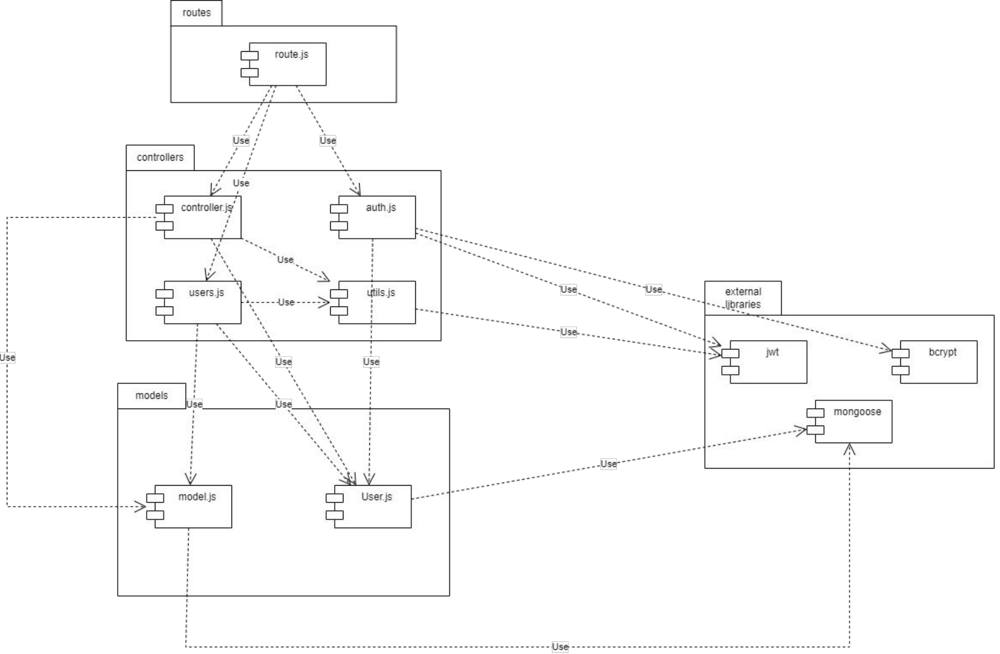

# Test Report

<The goal of this document is to explain how the application was tested, detailing how the test cases were defined and what they cover>

# Contents

- [Dependency graph](#dependency-graph)

- [Integration approach](#integration-approach)

- [Tests](#tests)

- [Coverage](#Coverage)

# Dependency graph 

     
# Integration approach

We decided to use the bottom-up approach for our tests. Due to this, firstly we tested the functions stored in auth.js and utils.js independently (by using unit tests), and when we were sure that they successfully fulfilled all the requirements we started testing the functions in users.js and controller.js.

For the sake of brevity, we won't include in the steps all the library functions (since we didn't test them and we assume that they are correct).

## Auth.js

- register

    Step 1: unit register

- registerAdmin

    Step 1: unit registerAdmin

- login

    Step 1: unit login

- logout

    Step 1: unit logout

## Utils.js

- handleDateFilterParams

    Step 1: unit handleDateFilterParams

- verifyAuth
    
    Step 1: unit verifyAuth

- handleAmountFilterParams

    Step 1: unit handleAmountFilterParam

## Users.js

## Controller.js
    
- createCategory

    Step 1: unit verifyAuth

    Step 2: unit verifyAuth+unit createCategory

- updateCategory

    Step 1: unit verifyAuth

    Step 2: unit verifyAuth+unit updateCategory

- deleteCategory

    Step 1: unit verifyAuth

    Step 2: unit verifyAuth+unit deleteCategory

- getCategories

    Step 1: unit verifyAuth

    Step 2: unit verifyAuth+unit getCategories

- createTransaction

    Step 1: unit verifyAuth

    Step 2: unit verifyAuth+unit createTransaction

- getAllTransactions

    Step 1: unit verifyAuth

    Step 2: unit verifyAuth+unit getAllTransactions

- getTransactionsByUser

    Step 1: unit verifyAuth

    Step 2: unit handleDateFilterParams

    Step 3: unit handleAmountFilterParams

    Step 4: unit verifyAuth+unit handleDateFilterParams+unit handleAmountFilterParams+unit getTransactionsByUser
    
- getTransactionsByUserByCategory

    Step 1: unit verifyAuth

    Step 2: unit verifyAuth+unit getTransactionsByUserByCategory
    
- getTransactionsByGroup

    Step 1: unit verifyAuth

    Step 2: unit verifyAuth+unit getTransactionsByGroup
    
- getTransactionsByGroupByCategory

    Step 1: unit verifyAuth

    Step 2: unit verifyAuth+unit getTransactionsByGroupByCategory
    
- deleteTransaction

    Step 1: unit verifyAuth

    Step 2: unit verifyAuth+unit deleteTransaction
    
- deleteTransactions

    Step 1: unit verifyAuth

    Step 2: unit verifyAuth+unit deleteTransactions

# Tests

   <in the table below list the test cases defined For each test report the object tested, the test level (API, integration, unit) and the technique used to define the test case  (BB/ eq partitioning, BB/ boundary, WB/ statement coverage, etc)>   <split the table if needed>

## Auth.js

### Unit

| Test case name                                       | Object(s) tested | Test level | Technique used |
| ---------------------------------------------------- | ---------------- | ---------- | -------------- |
| Register                                             | ------           | ------     | ------         |
| Correct registration                                 | register         | Unit       | WB             |
| Missing username                                     | register         | Unit       | WB             |
| Missing email                                        | register         | Unit       | WB             |
| Missing password                                     | register         | Unit       | WB             |
| Empty username                                       | register         | Unit       | WB             |
| Empty email                                          | register         | Unit       | WB             |
| Empty password                                       | register         | Unit       | WB             |
| Email not valid                                      | register         | Unit       | WB             |
| Username already used                                | register         | Unit       | WB             |
| Email already used                                   | register         | Unit       | WB             |
| DB error                                             | register         | Unit       | WB             |
| Register admin                                       | ------           | ------     | ------         |
| Body is lacking username                             | registerAdmin    | Unit       | WB             |
| Body is lacking email                                | registerAdmin    | Unit       | WB             |
| Body is lacking password                             | registerAdmin    | Unit       | WB             |
| Username is an empty string                          | registerAdmin    | Unit       | WB             |
| Email is an empty string                             | registerAdmin    | Unit       | WB             |
| Password is an empty string                          | registerAdmin    | Unit       | WB             |
| Email is not in a valid format                       | registerAdmin    | Unit       | WB             |
| Username identifies an existing user                 | registerAdmin    | Unit       | WB             |
| Email identifies an existing user                    | registerAdmin    | Unit       | WB             |
| Admin registered                                     | registerAdmin    | Unit       | WB             |
| DB operation goes wrong                              | registerAdmin    | Unit       | WB             |
| Login                                                | ------           | ------     | ------         |
| Correct login                                        | login            | Unit       | WB             |
| Email missing                                        | login            | Unit       | WB             |
| Password missing                                     | login            | Unit       | WB             |
| Empty email                                          | login            | Unit       | WB             |
| Empty password                                       | login            | Unit       | WB             |
| Email not valid                                      | login            | Unit       | WB             |
| User not found                                       | login            | Unit       | WB             |
| Wrong password                                       | login            | Unit       | WB             |
| DB error                                             | register         | Unit       | WB             |
| Logout                                               | ------           | ------     | ------         |
| Request does not have a refresh token in the cookies | logout           | Unit       | WB             |
| Refresh token does not represent a user              | logout           | Unit       | WB             |
| User successfully logout                             | logout           | Unit       | WB             |
| DB operation goes wrong                              | logout           | Unit       | WB             |

### Integration

| Test case name                                       | Object(s) tested | Test level  | Technique used          |
| ---------------------------------------------------- | ---------------- | ----------- | ----------------------- |
| Register                                             | ------           | ------      | ------                  |
| Correct registration                                 | register         | Integration | BB equivalence+boundary |
| Missing username                                     | register         | Integration | BB equivalence          |
| Missing email                                        | register         | Integration | BB equivalence          |
| Missing password                                     | register         | Integration | BB equivalence          |
| Empty username                                       | register         | Integration | BB boundary             |
| Empty email                                          | register         | Integration | BB boundary             |
| Empty password                                       | register         | Integration | BB boundary             |
| Email not valid                                      | register         | Integration | BB equivalence+boundary |
| Username already used                                | register         | Integration | BB equivalence          |
| Email already used                                   | register         | Integration | BB equivalence          |
| Register admin                                       | ------           | ------      | ------                  |
| Body is lacking username                             | registerAdmin    | Integration | BB equivalence          |
| Body is lacking email                                | registerAdmin    | Integration | BB equivalence          |
| Body is lacking password                             | registerAdmin    | Integration | BB equivalence          |
| Username is an empty string                          | registerAdmin    | Integration | BB boundary             |
| Email is an empty string                             | registerAdmin    | Integration | BB boundary             |
| Password is an empty string                          | registerAdmin    | Integration | BB boundary             |
| Email is not in a valid format                       | registerAdmin    | Integration | BB equivalence          |
| Username identifies an existing user                 | registerAdmin    | Integration | BB equivalence          |
| Email identifies an existing user                    | registerAdmin    | Integration | BB equivalence          |
| Admin registered                                     | registerAdmin    | Integration | BB equivalence          |
| DB operation goes wrong                              | registerAdmin    | Integration | BB equivalence          |
| Login                                                | ------           | ------      | ------                  |
| Correct login                                        | login            | Integration | BB equivalence+boundary |
| Email missing                                        | login            | Integration | BB equivalence          |
| Password missing                                     | login            | Integration | BB equivalence          |
| Empty email                                          | login            | Integration | BB boundary             |
| Empty password                                       | login            | Integration | BB boundary             |
| Email not valid                                      | login            | Integration | BB equivalence+boundary |
| User not found                                       | login            | Integration | BB equivalence          |
| Wrong password                                       | login            | Integration | BB equivalence          |
| Logout                                               | ------           | ------      | ------                  |
| Request does not have a refresh token in the cookies | logout           | Integration | BB equivalence+boundary |
| Refresh token does not represent a user              | logout           | Integration | BB equivalence          |
| User successfully logout                             | logout           | Integration | BB equivalence          |
| DB operation goes wrong                              | logout           | Integration | BB equivalence          |

## Utils.js

### Unit

| Test case name | Object(s) tested | Test level | Technique used |
| -------------- | ---------------- | ---------- | -------------- |
| Handle date filter params | ------    |  ------   |   ------    |
|should throw an error if `date` is present in the query parameter together with from or upTo|handleDateFilterParams|Unit|WB|
|should return filter object with  `$gte` and `$lte` attributes if  `date` is present|handleDateFilterParams|Unit|WB|
|should return filter object with `$gte` attribute if the query parameters include `from`|handleDateFilterParams|Unit|WB|
|should return filter object with `$lte` attribute if the query parameters include `upTo`|Unit|WB|
|should return filter object with `$lte` and `$gte` attribute if the query parameters include `from` and `upTo`|handleDateFilterParams|Unit|WB|
|should return an empty object if there is no query parameter|handleDateFilterParams|Unit|WB|
|should throw an error if the value of any of the three query parameters is not a string that represents a date in the format **YYYY-MM-DD**|handleDateFilterParams|Unit|WB|
|should throw an error if `date` is not `isValidDate`|handleDateFilterParams|Unit|WB|
|should throw an error if `from` is not `isValidDate`|handleDateFilterParams|Unit|WB|
|should throw an error if `upTo` is not `isValidDate`|handleDateFilterParams|Unit|WB|
| Verify auth | ------    |  ------   |   ------    |
|should return { flag: false, cause: 'Unauthorized' } if request not have cookies|verifyAuth|Unit|WB|
|should return { flag: false, cause: 'Token is missing information' } if accessToken does not include email|verifyAuth|Unit|WB|
|should return { flag: false, cause: 'Token is missing information' } if refreshToken does not include email|verifyAuth|Unit|WB|
|should return { flag: false, cause: 'Mismatched users' } if accessToken and refreshToken are not matched|Unit|WB|
|should return { flag: false, cause: 'Wrong User auth request' } if the accessToken or the refreshToken have a `username` different from the requested one|verifyAuth|Unit|WB|
|should return { flag: false, cause: 'Wrong Admin auth request' } if the accessToken or the refreshToken have a `role` different from the requested one|verifyAuth|Unit|WB|
|should return { flag: false, cause: 'Wrong Group auth request' } if the accessToken or the refreshToken email is not in the member array|verifyAuth|Unit|WB|
|should refreshes the `accessToken` if it has expired and the `refreshToken` allows authentication; sets the `refreshedTokenMessage` to inform users that the `accessToken` must be changed|verifyAuth|Unit|WB|
|should return {flag: false, cause: 'Perform login again'} if it `refreshToken` is expired|verifyAuth|Unit|WB|
|should return { flag: true, cause: 'Authorized' } if authentication is valid|verifyAuth|Unit|WB|
|User auth fails with token expired|verifyAuth|Unit|WB|
|Admin auth fails with token expired|verifyAuth|Unit|WB|
|Group auth fails with token expired|verifyAuth|Unit|WB|
|Group auth correct with token expired|verifyAuth|Unit|WB|
|Group auth correct|verifyAuth|Unit|WB|
|Generic error with token expired|verifyAuth|Unit|WB|
|Generic error without token expired|verifyAuth|Unit|WB|
| Handle amount filter params | ------    |  ------   |   ------    |
|should throw an error if the value of any of the two query parameters is not a numerical value|handleAmountFilterParams|Unit|WB|
|should throw "Min or max parameter is not a number" if min/max is not numerical|handleAmountFilterParams|Unit|WB|
|should return {} if the function is used without any min/max parameters|handleAmountFilterParams|Unit|WB|
|should return filter object with  `$gte` attributes if `min` is present|handleAmountFilterParams|Unit|WB|
|should return filter object with  `$lte` attributes if  `max` is present|handleAmountFilterParams|Unit|WB|
|should return filter object with  `$lte` and `$gte` attributes if  `max` and `min` is present|handleAmountFilterParams|Unit|WB|

### Integration

| Test case name | Object(s) tested | Test level | Technique used |
| -------------- | ---------------- | ---------- | -------------- |
| Handle date filter params | ------    |  ------   |   ------    |
|should throw an error if `date` is present in the query parameter together with from or upTo|handleDateFilterParams|Integration|BB equivalence|
|should return filter object with  `$gte` and `$lte` attributes if  `date` is present|handleDateFilterParams|Integration|BB equivalence+boundary|
|should return filter object with `$gte` attribute if the query parameters include `from`|handleDateFilterParams|Integration|BB equivalence+boundary|
|should return filter object with `$lte` attribute if the query parameters include `upTo`|Integration|BB equivalence+boundary|
|should return filter object with `$lte` and `$gte` attribute if the query parameters include `from` and `upTo`|handleDateFilterParams|Integration|BB equivalence+boundary|
|should return an empty object if there is no query parameter|handleDateFilterParams|Integration|BB boundary|
|should throw an error if the value of any of the three query parameters is not a string that represents a date in the format **YYYY-MM-DD**|handleDateFilterParams|Integration|BB boundary|
|should throw an error if `date` is not `isValidDate`|handleDateFilterParams|Integration|BB equivalence+boundary|
|should throw an error if `from` is not `isValidDate`|handleDateFilterParams|Integration|BB equivalence+boundary|
|should throw an error if `upTo` is not `isValidDate`|handleDateFilterParams|Integration|BB equivalence+boundary|
| Verify auth | ------    |  ------   |   ------    |
|should return { flag: false, cause: 'Unauthorized' } if request not have cookies|verifyAuth|Integration|BB equivalence|
|should return { flag: false, cause: 'Token is missing information' } if accessToken does not include email|verifyAuth|Integration|BB equivalence|
|should return { flag: false, cause: 'Token is missing information' } if refreshToken does not include email|verifyAuth|Integration|BB equivalence|
|should return { flag: false, cause: 'Mismatched users' } if accessToken and refreshToken are not matched|Integration|BB equivalence|
|should return { flag: false, cause: 'Wrong User auth request' } if the accessToken or the refreshToken have a `username` different from the requested one|verifyAuth|Integration|BB equivalence|
|should return { flag: false, cause: 'Wrong Admin auth request' } if the accessToken or the refreshToken have a `role` different than admin|verifyAuth|Integration|BB equivalence|
|should return { flag: false, cause: 'Wrong Group auth request' } if the accessToken or the refreshToken email is not in the member array|verifyAuth|Integration|BB equivalence|
|should refresh the `accessToken` if it has expired and the `refreshToken` allows authentication; sets the `refreshedTokenMessage` to inform users that the `accessToken` must be changed|verifyAuth|Integration|BB equivalence|
|should return {flag: false, cause: 'Perform login again'} if it `refreshToken` is expired|verifyAuth|Integration|BB equivalence|
|should return { flag: true, cause: 'Authorized' } if authentication is valid|verifyAuth|Integration|BB equivalence+boundary|
|Correct admin auth|verifyAuth|Integration|BB equivalence+boundary|
|User auth fails with token expired|verifyAuth|Integration|BB equivalence+boundary|
|User auth succeeds with token expired|verifyAuth|Integration|BB equivalence+boundary|
|Admin auth fails with token expired|verifyAuth|Integration|BB equivalence+boundary|
|Admin auth succeeds with token expired|verifyAuth|Integration|BB equivalence+boundary|
|Group auth fails with token expired|verifyAuth|Integration|BB equivalence+boundary|
|Group auth correct with token expired|verifyAuth|Integration|BB equivalence+boundary|
|Group auth correct|verifyAuth|Integration|BB equivalence|
| Handle amount filter params | ------    |  ------   |   ------    |
|should throw an error if the value of any of the two query parameters is not a numerical value|handleAmountFilterParams|Integration|BB equivalence|
|should throw "Min or max parameter is not a number" if min/max is not numerical|handleAmountFilterParams|Integration|BB equivalence|
|should return {} if the function is used without any min/max parameters|handleAmountFilterParams|Integration|BB equivalence|
|should return filter object with  `$gte` attributes if `min` is present|handleAmountFilterParams|Integration|BB equivalence|
|should return filter object with  `$lte` attributes if  `max` is present|handleAmountFilterParams|Integration|BB equivalence|
|should return filter object with  `$lte` and `$gte` attributes if  `max` and `min` is present|handleAmountFilterParams|Integration|BB equivalence|

## Users.js

### Unit

| Test case name | Object(s) tested | Test level | Technique used |
| -------------- | ---------------- | ---------- | -------------- |
|                |                  |            |                |

### Integration

| Test case name | Object(s) tested | Test level | Technique used |
| -------------- | ---------------- | ---------- | -------------- |
|                |                  |            |                |

## Controller.js

### Unit

| Test case name                                                                                                    | Object(s) tested                 | Test level | Technique used |
| ----------------------------------------------------------------------------------------------------------------- | -------------------------------- | ---------- | -------------- |
| Create category                                                                                                   | ------                           | ------     | ------         |
| Correct category insertion                                                                                        | createCategory                   | Unit       | WB             |
| Missing type                                                                                                      | createCategory                   | Unit       | WB             |
| Missing color                                                                                                     | createCategory                   | Unit       | WB             |
| Missing type and color                                                                                            | createCategory                   | Unit       | WB             |
| Empty type                                                                                                        | createCategory                   | Unit       | WB             |
| Empty color                                                                                                       | createCategory                   | Unit       | WB             |
| Empty type, missing color                                                                                         | createCategory                   | Unit       | WB             |
| Insert twice a category with the same name                                                                        | createCategory                   | Unit       | WB             |
| Not an admin                                                                                                      | createCategory                   | Unit       | WB             |
| DB insertion goes wrong                                                                                           | createCategory                   | Unit       | WB             |
| Update category                                                                                                   | ------                           | ------     | ------         |
| Correct update                                                                                                    | updateCategory                   | Unit       | WB             |
| Missing type                                                                                                      | updateCategory                   | Unit       | WB             |
| Missing color                                                                                                     | updateCategory                   | Unit       | WB             |
| Missing type and color                                                                                            | updateCategory                   | Unit       | WB             |
| Empty type                                                                                                        | updateCategory                   | Unit       | WB             |
| Empty color                                                                                                       | updateCategory                   | Unit       | WB             |
| Empty type, missing color                                                                                         | updateCategory                   | Unit       | WB             |
| Category not existing                                                                                             | updateCategory                   | Unit       | WB             |
| New type already in use                                                                                           | updateCategory                   | Unit       | WB             |
| Not an admin                                                                                                      | updateCategory                   | Unit       | WB             |
| DB update goes wrong                                                                                              | updateCategory                   | Unit       | WB             |
| Delete category                                                                                                   | ------                           | ------     | ------         |
| Correct, N>T                                                                                                      | deleteCategory                   | Unit       | WB             |
| Correct, N=T                                                                                                      | deleteCategory                   | Unit       | WB             |
| Types not passed                                                                                                  | deleteCategory                   | Unit       | WB             |
| Try to delete the last category                                                                                   | deleteCategory                   | Unit       | WB             |
| One of the types is an empty string                                                                               | deleteCategory                   | Unit       | WB             |
| Empty array                                                                                                       | deleteCategory                   | Unit       | WB             |
| One of the types isn't a category                                                                                 | deleteCategory                   | Unit       | WB             |
| Not an admin                                                                                                      | deleteCategory                   | Unit       | WB             |
| DB delete goes wrong                                                                                              | deleteCategory                   | Unit       | WB             |
| Get categories                                                                                                    | ------                           | ------     | ------         |
| Correct category retrieval                                                                                        | getCategories                    | Unit       | WB             |
| Not logged in                                                                                                     | getCategories                    | Unit       | WB             |
| DB retrieval goes wrong                                                                                           | getCategories                    | Unit       | WB             |
| Create transaction                                                                                                | ------                           | ------     | ------         |
| Correct transaction creation                                                                                      | createTransaction                | Unit       | WB             |
| Username missing                                                                                                  | createTransaction                | Unit       | WB             |
| Amount missing                                                                                                    | createTransaction                | Unit       | WB             |
| Type missing                                                                                                      | createTransaction                | Unit       | WB             |
| Username empty                                                                                                    | createTransaction                | Unit       | WB             |
| Type empty                                                                                                        | createTransaction                | Unit       | WB             |
| Category not existing                                                                                             | createTransaction                | Unit       | WB             |
| The username of the transaction is different by the one in the route                                              | createTransaction                | Unit       | WB             |
| The username of the transaction doesn't exist                                                                     | createTransaction                | Unit       | WB             |
| The username in the route doesn't exist                                                                           | createTransaction                | Unit       | WB             |
| The amount is not a float                                                                                         | createTransaction                | Unit       | WB             |
| Not the same user/not logged in                                                                                   | createTransaction                | Unit       | WB             |
| DB insertion goes wrong                                                                                           | createTransaction                | Unit       | WB             |
| Get all transactions                                                                                              | ------                           | ------     | ------         |
| Correct retrieval                                                                                                 | getAllTransactions               | Unit       | WB             |
| Not an admin                                                                                                      | getAllTransactions               | Unit       | WB             |
| DB retrieval goes wrong                                                                                           | getAllTransactions               | Unit       | WB             |
| Get transactions by user                                                                                          | ------                           | ------     | ------         |
| User in route does not represent user in DB                                                                       | getTransactionsByUser            | Unit       | WB             |
| /api/users/:username/transactions : Authenticated user is not the same as the one in the route                    | getTransactionsByUser            | Unit       | WB             |
| /api/transactions/users/:username : Authenticated user is not an admin                                            | getTransactionsByUser            | Unit       | WB             |
| Correct retrieval with no parameters                                                                              | getTransactionsByUser            | Unit       | WB             |
| Correct retrieval with parameters                                                                                 | getTransactionsByUser            | Unit       | WB             |
| DB retrieval goes wrong                                                                                           | getTransactionsByUser            | Unit       | WB             |
| Get transactions by user by category                                                                              | ------                           | ------     | ------         |
| User in route does not represent user in DB                                                                       | getTransactionsByUserByCategory  | Unit       | WB             |
| Category in route does not represent category in DB                                                               | getTransactionsByUserByCategory  | Unit       | WB             |
| /api/users/:username/transactions/category/:category : Authenticated user is not the same as the one in the route | getTransactionsByUserByCategory  | Unit       | WB             |
| /api/transactions/users/:username/category/:category : Authenticated user is not an admin                         | getTransactionsByUserByCategory  | Unit       | WB             |
| Correct retrieval                                                                                                 | getTransactionsByUserByCategory  | Unit       | WB             |
| DB retrieval goes wrong                                                                                           | getTransactionsByUserByCategory  | Unit       | WB             |
| Get transactions by group                                                                                         | ------                           | ------     | ------         |
| Group name in route does not represent group in DB                                                                | getTransactionsByGroup           | Unit       | WB             |
| /api/groups/:name/transactions : Authenticated user is not part of the group                                      | getTransactionsByGroup           | Unit       | WB             |
| /api/transactions/groups/:name : Authenticated user is not an admin                                               | getTransactionsByGroup           | Unit       | WB             |
| Correct retrieval                                                                                                 | getTransactionsByGroup           | Unit       | WB             |
| DB retrieval goes wrong                                                                                           | getTransactionsByGroup           | Unit       | WB             |
| Get transactions by group by category                                                                             | ------                           | ------     | ------         |
| Group name in route does not represent group in DB                                                                | getTransactionsByGroupByCategory | Unit       | WB             |
| Category name in route does not represent category in DB                                                          | getTransactionsByGroupByCategory | Unit       | WB             |
| /api/groups/:name/transactions/category/:category : Authenticated user is not part of the group                   | getTransactionsByGroupByCategory | Unit       | WB             |
| /api/transactions/groups/:name/category/:category : Authenticated user is not an admin                            | getTransactionsByGroupByCategory | Unit       | WB             |
| Correct retrieval                                                                                                 | getTransactionsByGroupByCategory | Unit       | WB             |
| DB retrieval goes wrong                                                                                           | getTransactionsByGroupByCategory | Unit       | WB             |
| Delete transaction                                                                                                | ------                           | ------     | ------         |
| Request body does not contain all attributes                                                                      | deleteTransaction                | Unit       | WB             |
| "_id" in body is an empty string                                                                                  | deleteTransaction                | Unit       | WB             |
| User in route parameter is not present in DB                                                                      | deleteTransaction                | Unit       | WB             |
| "_id" does not represent a transaction                                                                            | deleteTransaction                | Unit       | WB             |
| "_id" represents a transaction made by a different user                                                           | deleteTransaction                | Unit       | WB             |
| Authenticated user is not the same one specified in the route                                                     | deleteTransaction                | Unit       | WB             |
| Successful deletion                                                                                               | deleteTransaction                | Unit       | WB             |
| DB operation goes wrong                                                                                           | deleteTransaction                | Unit       | WB             |
| Delete transactions                                                                                               | ------                           | ------     | ------         |
| Request body does not contain all attributes                                                                      | deleteTransactions               | Unit       | WB             |
| At least one of the provided ids is an empty string                                                               | deleteTransactions               | Unit       | WB             |
| At least one of the provided ids does not represent a transaction                                                 | deleteTransactions               | Unit       | WB             |
| Authenticated user is not an admin                                                                                | deleteTransactions               | Unit       | WB             |
| Transactions deleted successfully                                                                                 | deleteTransactions               | Unit       | WB             |
| DB operation goes wrong                                                                                           | deleteTransactions               | Unit       | WB             |

### Integration

| Test case name                                                                                                    | Object(s) tested                 | Test level  | Technique used          |
| ----------------------------------------------------------------------------------------------------------------- | -------------------------------- | ----------- | ----------------------- |
| Create category                                                                                                   | ------                           | ------      | ------                  |
| Correct category insertion                                                                                        | createCategory                   | Integration | BB equivalence+boundary |
| Missing type                                                                                                      | createCategory                   | Integration | BB equivalence          |
| Missing color                                                                                                     | createCategory                   | Integration | BB equivalence          |
| Missing type and color                                                                                            | createCategory                   | Integration | BB equivalence          |
| Empty type                                                                                                        | createCategory                   | Integration | BB boundary             |
| Empty color                                                                                                       | createCategory                   | Integration | BB boundary             |
| Empty type, missing color                                                                                         | createCategory                   | Integration | BB equivalence+boundary |
| Insert twice a category with the same name                                                                        | createCategory                   | Integration | BB equivalence          |
| Not an admin                                                                                                      | createCategory                   | Integration | BB equivalence          |
| Not logged in                                                                                                     | createCategory                   | Integration | BB equivalence          |
| Update category                                                                                                   | ------                           | ------      | ------                  |
| Correct update                                                                                                    | updateCategory                   | Integration | BB equivalence+boundary |
| Missing type                                                                                                      | updateCategory                   | Integration | BB equivalence          |
| Missing color                                                                                                     | updateCategory                   | Integration | BB equivalence          |
| Missing type and color                                                                                            | updateCategory                   | Integration | BB equivalence          |
| Empty type                                                                                                        | updateCategory                   | Integration | BB boundary             |
| Empty color                                                                                                       | updateCategory                   | Integration | BB boundary             |
| Empty type, missing color                                                                                         | updateCategory                   | Integration | BB equivalence+boundary |
| Category not existing                                                                                             | updateCategory                   | Integration | BB equivalence          |
| New type already in use                                                                                           | updateCategory                   | Integration | BB equivalence          |
| Not an admin                                                                                                      | updateCategory                   | Integration | BB equivalence          |
| Not logged in                                                                                                     | updateCategory                   | Integration | BB equivalence          |
| Delete category                                                                                                   | ------                           | ------      | ------                  |
| Correct, N>T                                                                                                      | deleteCategory                   | Integration | BB equivalence          |
| Correct, N=T                                                                                                      | deleteCategory                   | Integration | BB equivalence+boundary |
| Types not passed                                                                                                  | deleteCategory                   | Integration | BB equivalence          |
| Try to delete the last category                                                                                   | deleteCategory                   | Integration | BB equivalence+boundary |
| One of the types is an empty string                                                                               | deleteCategory                   | Integration | BB boundary             |
| Empty array                                                                                                       | deleteCategory                   | Integration | BB boundary             |
| One of the types isn't a category                                                                                 | deleteCategory                   | Integration | BB equivalence+boundary |
| Not an admin                                                                                                      | deleteCategory                   | Integration | BB equivalence          |
| Not logged in                                                                                                     | deleteCategory                   | Integration | BB equivalence          |
| Get categories                                                                                                    | ------                           | ------      | ------                  |
| Correct category retrieval (admin)                                                                                | getCategories                    | Integration | BB equivalence+boundary |
| Correct category retrieval (user)                                                                                 | getCategories                    | Integration | BB equivalence+boundary |
| Not logged in                                                                                                     | getCategories                    | Integration | BB equivalence          |
| Create transaction                                                                                                | ------                           | ------      | ------                  |
| Correct transaction creation (user, positive amount)                                                              | createTransaction                | Integration | BB equivalence+boundary |
| Correct transaction creation (admin, negative amount)                                                             | createTransaction                | Integration | BB equivalence+boundary |
| Correct transaction creation (user, MIN_FLOAT)                                                                    | createTransaction                | Integration | BB equivalence+boundary |
| Correct transaction creation (admin, MAX_FLOAT)                                                                   | createTransaction                | Integration | BB equivalence+boundary |
| Username missing                                                                                                  | createTransaction                | Integration | BB equivalence          |
| Amount missing                                                                                                    | createTransaction                | Integration | BB equivalence          |
| Type missing                                                                                                      | createTransaction                | Integration | BB equivalence          |
| Username empty                                                                                                    | createTransaction                | Integration | BB boundary             |
| Type empty                                                                                                        | createTransaction                | Integration | BB boundary             |
| Category not existing                                                                                             | createTransaction                | Integration | BB equivalence          |
| The username of the transaction is different by the one in the route                                              | createTransaction                | Integration | BB equivalence          |
| The username of the transaction doesn't exist                                                                     | createTransaction                | Integration | BB equivalence          |
| The username in the route doesn't exist                                                                           | createTransaction                | Integration | BB equivalence          |
| The amount is not a float                                                                                         | createTransaction                | Integration | BB boundary             |
| Not the same user                                                                                                 | createTransaction                | Integration | BB equivalence          |
| Not logged in                                                                                                     | createTransaction                | Integration | BB equivalence          |
| Get all transactions                                                                                              | ------                           | ------      | ------                  |
| Correct retrieval                                                                                                 | getAllTransactions               | Integration | BB equivalence          |
| Not an admin                                                                                                      | getAllTransactions               | Integration | BB equivalence          |
| DB retrieval goes wrong                                                                                           | getAllTransactions               | Integration | BB equivalence          |
| Get transactions by user                                                                                          | ------                           | ------      | ------                  |
| User in route does not represent user in DB                                                                       | getTransactionsByUser            | Integration | BB equivalence          |
| /api/users/:username/transactions : Authenticated user is not the same as the one in the route                    | getTransactionsByUser            | Integration | BB equivalence          |
| /api/transactions/users/:username : Authenticated user is not an admin                                            | getTransactionsByUser            | Integration | BB equivalence          |
| Correct retrieval with no parameters                                                                              | getTransactionsByUser            | Integration | BB equivalence          |
| Correct retrieval with parameters                                                                                 | getTransactionsByUser            | Integration | BB equivalence          |
| DB retrieval goes wrong                                                                                           | getTransactionsByUser            | Integration | BB equivalence          |
| Get transactions by user by category                                                                              | ------                           | ------      | ------                  |
| User in route does not represent user in DB                                                                       | getTransactionsByUserByCategory  | Integration | BB equivalence          |
| Category in route does not represent category in DB                                                               | getTransactionsByUserByCategory  | Integration | BB equivalence          |
| /api/users/:username/transactions/category/:category : Authenticated user is not the same as the one in the route | getTransactionsByUserByCategory  | Integration | BB equivalence          |
| /api/transactions/users/:username/category/:category : Authenticated user is not an admin                         | getTransactionsByUserByCategory  | Integration | BB equivalence          |
| Correct retrieval                                                                                                 | getTransactionsByUserByCategory  | Integration | BB equivalence          |
| DB retrieval goes wrong                                                                                           | getTransactionsByUserByCategory  | Integration | BB equivalence          |
| Get transactions by group                                                                                         | ------                           | ------      | ------                  |
| Group name in route does not represent group in DB                                                                | getTransactionsByGroup           | Integration | BB equivalence          |
| /api/groups/:name/transactions : Authenticated user is not part of the group                                      | getTransactionsByGroup           | Integration | BB equivalence          |
| /api/transactions/groups/:name : Authenticated user is not an admin                                               | getTransactionsByGroup           | Integration | BB equivalence          |
| Correct retrieval                                                                                                 | getTransactionsByGroup           | Integration | BB equivalence          |
| DB retrieval goes wrong                                                                                           | getTransactionsByGroup           | Integration | BB equivalence          |
| Get transactions by group by category                                                                             | ------                           | ------      | ------                  |
| Group name in route does not represent group in DB                                                                | getTransactionsByGroupByCategory | Integration | BB equivalence          |
| Category name in route does not represent category in DB                                                          | getTransactionsByGroupByCategory | Integration | BB equivalence          |
| /api/groups/:name/transactions/category/:category : Authenticated user is not part of the group                   | getTransactionsByGroupByCategory | Integration | BB equivalence          |
| /api/transactions/groups/:name/category/:category : Authenticated user is not an admin                            | getTransactionsByGroupByCategory | Integration | BB equivalence          |
| Correct retrieval                                                                                                 | getTransactionsByGroupByCategory | Integration | BB equivalence          |
| DB retrieval goes wrong                                                                                           | getTransactionsByGroupByCategory | Integration | BB equivalence          |
| Delete transaction                                                                                                | ------                           | ------      | ------                  |
| Request body does not contain all attributes                                                                      | deleteTransaction                | Integration | BB equivalence          |
| "_id" in body is an empty string                                                                                  | deleteTransaction                | Integration | BB boundary             |
| User in route parameter is not present in DB                                                                      | deleteTransaction                | Integration | BB equivalence          |
| "_id" does not represent a transaction                                                                            | deleteTransaction                | Integration | BB equivalence          |
| "_id" represents a transaction made by a different user                                                           | deleteTransaction                | Integration | BB equivalence          |
| Authenticated user is not the same one specified in the route                                                     | deleteTransaction                | Integration | BB equivalence          |
| Successful deletion                                                                                               | deleteTransaction                | Integration | BB equivalence          |
| DB operation goes wrong                                                                                           | deleteTransaction                | Integration | BB equivalence          |
| Delete transactions                                                                                               | ------                           | ------      | ------                  |
| Request body does not contain all attributes                                                                      | deleteTransactions               | Integration | BB equivalence          |
| At least one of the provided ids is an empty string                                                               | deleteTransactions               | Integration | BB equivalence+boundary |
| At least one of the provided ids does not represent a transaction                                                 | deleteTransactions               | Integration | BB equivalence          |
| Authenticated user is not an admin                                                                                | deleteTransactions               | Integration | BB equivalence          |
| Transactions deleted successfully                                                                                 | deleteTransactions               | Integration | BB equivalence          |
| DB operation goes wrong                                                                                           | deleteTransactions               | Integration | BB equivalence          |

# Coverage

## Coverage of FR

<Report in the following table the coverage of  functional requirements (from official requirements) >

In the table, for tests we reported the test suites and not the individual tests. In fact, all the tests belonging to a certain suite cover the same functional requirements, and it would have been useless and too messy to report all the test cases. Furthermore, the test suites are both for unit and integration testing (since we gave to them the same name).

| Functional Requirements covered | Test suite(s)                    |
| ------------------------------- | -------------------------------- |
| FR11                            | register                         |
| FR12                            | login                            |
| FR13                            | logout                           |
| FR14                            | registerAdmin                    |
| FR15                            |                                  |
| FR16                            |                                  |
| FR17                            |                                  |
| FR21                            |                                  |
| FR22                            |                                  |
| FR23                            |                                  |
| FR24                            |                                  |
| FR26                            |                                  |
| FR28                            |                                  |
| FR31                            | createTransaction, verifyAuth    |
| FR32                            | getAllTransactions, verifyAuth   |
| FR33                            | getTransactionsByUser, handleDateFilterParams, handleAmountFilterParams, verifyAuth |
| FR34                            | getTransactionsByUserByCategory, verifyAuth |
| FR35                            | getTransactionsByGroup, verifyAuth |
| FR36                            | getTransactionsByGroupByCategory, verifyAuth |
| FR37                            | deleteTransaction, verifyAuth    |
| FR38                            | deleteTransactions, verifyAuth   |
| FR41                            | createCategory, verifyAuth       |
| FR42                            | updateCategory, verifyAuth       |
| FR43                            | deleteCategory, verifyAuth       |
| FR44                            | getCategories, verifyAuth        |

## Coverage white box

Report here the screenshot of coverage values obtained with jest-- coverage 

